# Performing an Inspection \#

## Carrying out the First Inspection on an Asset

From the _Home_ page select _Asset Tools_.

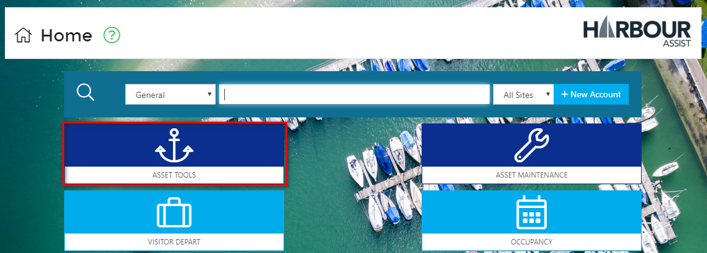

Then select _Asset List_.

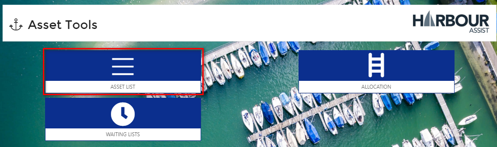

Filter your Assets to the ones that you need to inspect \(this could just be the Inspection Assets\), remembering to click on the _Include Unusable_ box to ensure all the Assets are shown.

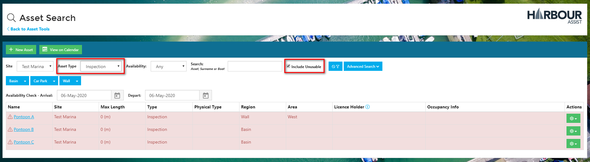

Select the first Asset you need to inspect by clicking on the Asset name.

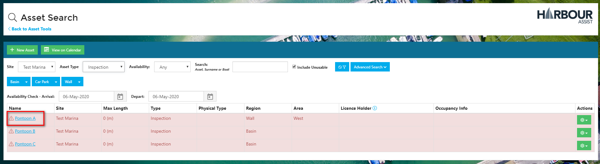

Select _New Inspection_.

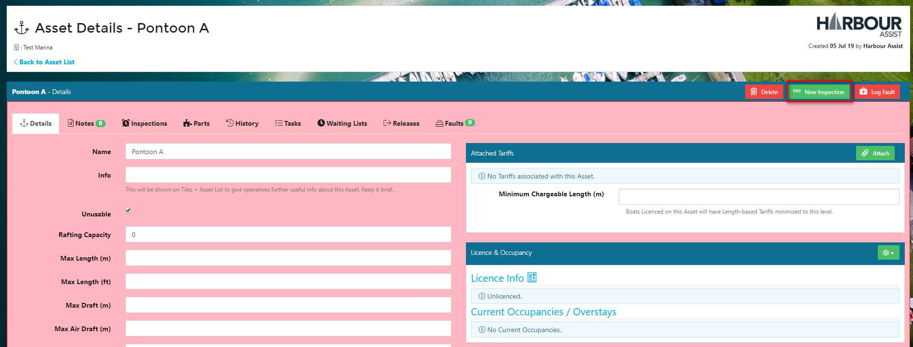

Select the Inspection Type you wish to carry out and then click on _Create_.

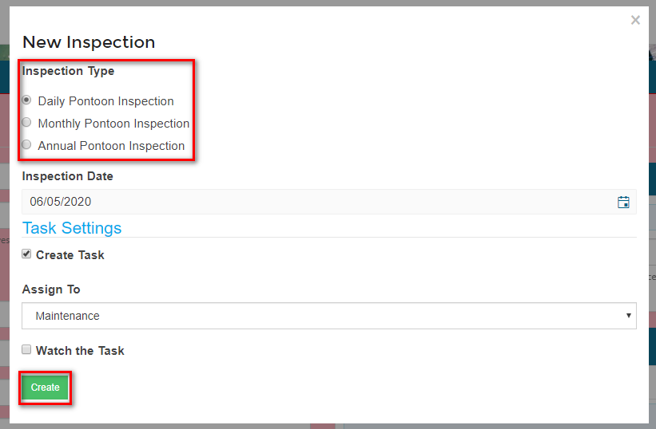

The Inspection Details screen will open up which will show you some details of the Asset and a Briefing.

Work your way through each of the Inspection items, marking the Results and making any notes as you do so.

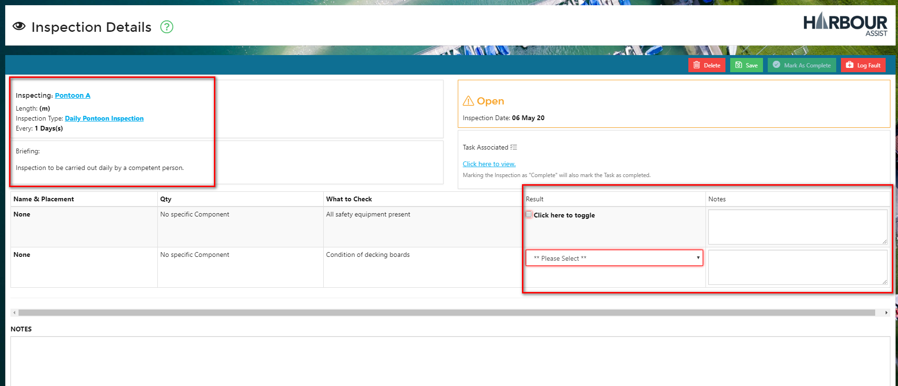

If there are any Faults that need logging, click on _Log Fault_ at the top of the screen.

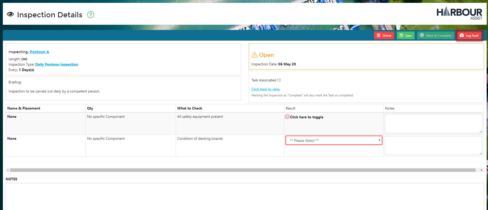

The Fault should be logged and a Task set.

?&gt; More documentation [here](https://github.com/glaidler/docs-1/tree/a9b2fde53025657e319d99966ea9a02a32cbd61d/Maintenance/Maintenance/Faults.md).

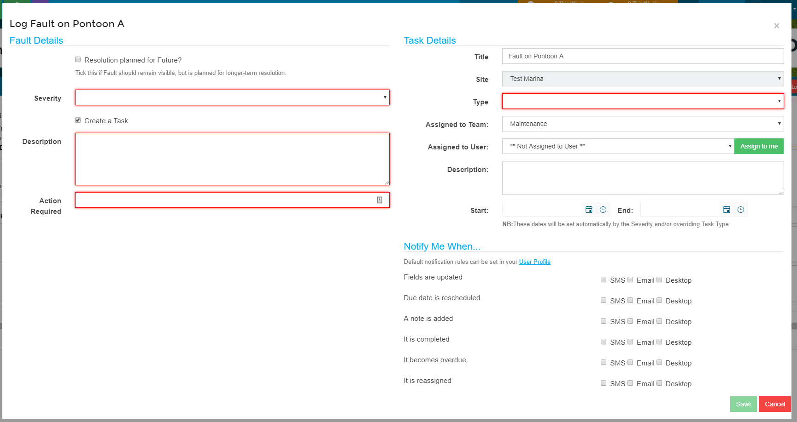

The Inspection can be saved at any point, so that you can go back and complete it at a later time.

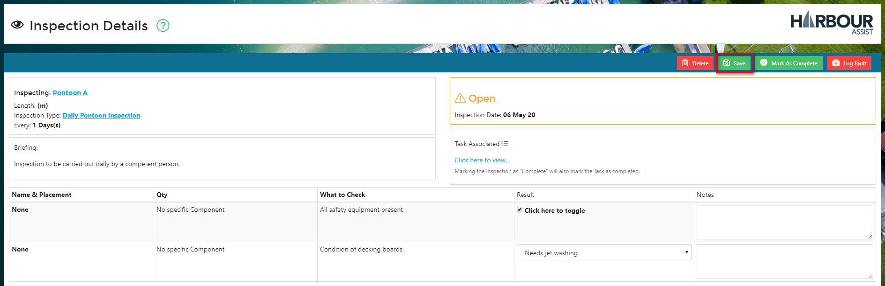

Once all the Inspection items have been checked and the results logged you should click on _Mark as Complete_.

?&gt; NB: You will not be able to complete an Inspection until all of the mandatory items have been checked.

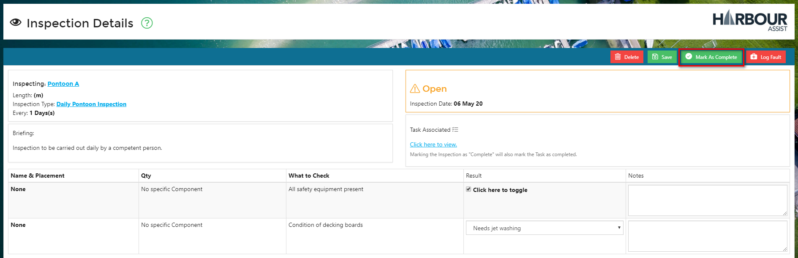

The next Inspection details will be automatically populated in line with the Inspection Type set up, however you can change these in this screen if you need to.

A reminder Task will be set for Team when the next Inspection is due.

Select _Completed_.

A confirmation screen will be shown - select OK.

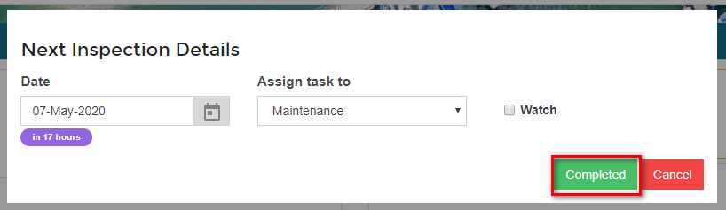

The Inspection will now show as Completed.

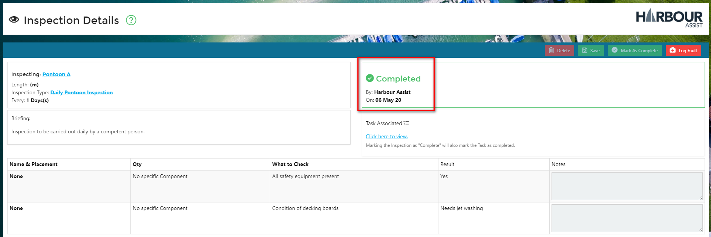

Use the Back button to return to the Asset.

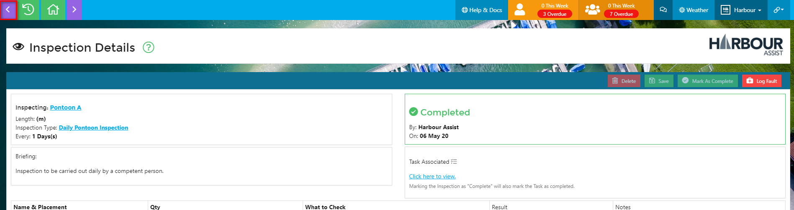

If you wish to view Inspection information for the Asset click on the _Inspections_ tab where historic and future scheduled Inspections will show.

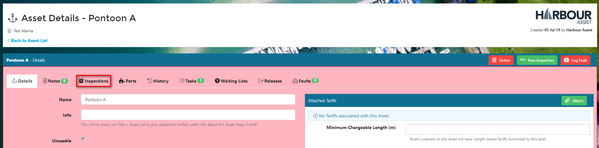

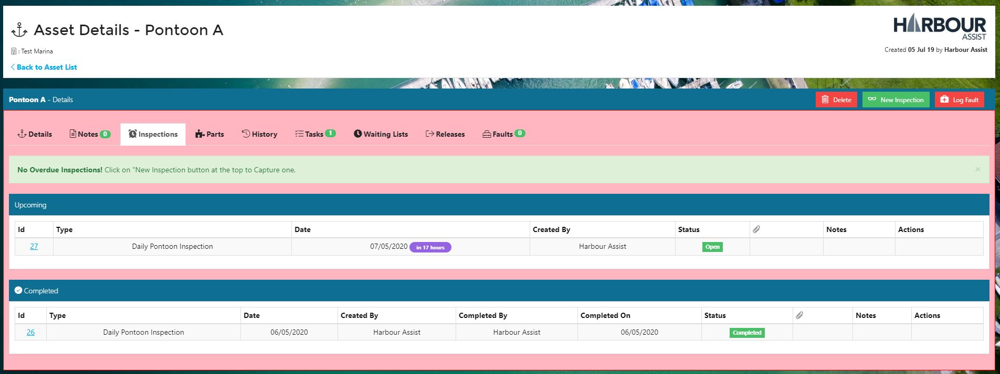

To return to your _Asset List_ select _Back to Asset List_.

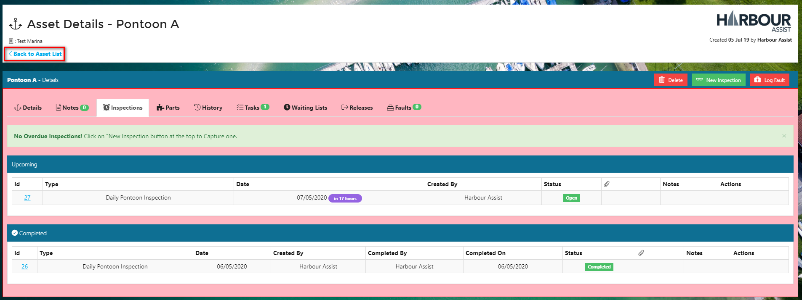

You can now select the next Asset to inspect.

## Carrying out Recurring Inspections

Once you have carried out the first inspection of a particular Inspection Type on an asset, the next Inspection date is set automatically and a Task is created for the Team responsible for carrying out the next Inspection.

As each Inspections becomes due, the Team will be shown a Task Notification in the Task bar at the top of the screen.

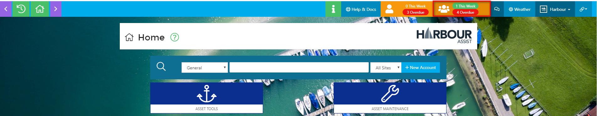

Click on the Task Notification view the Tasks and open up the Task details by clicking on the number.

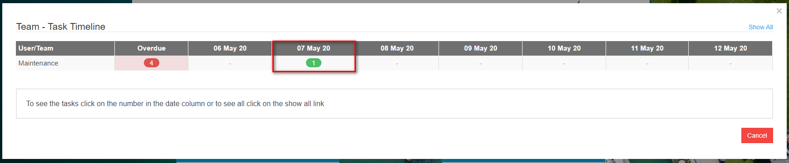

You can now select each Inspection by clicking on the Link and this will take you straight to the Inspection where you can complete it as above.

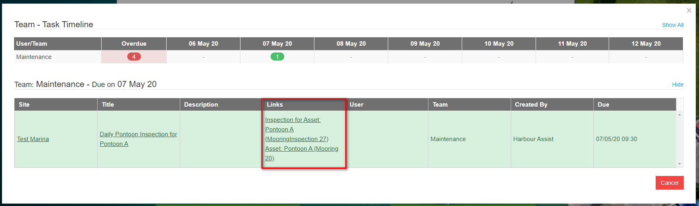

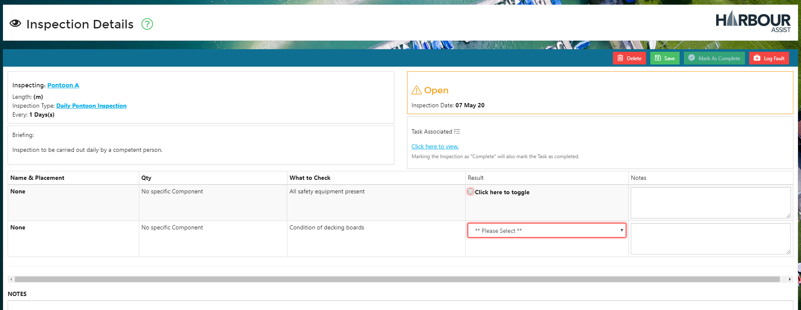

?&gt; NB: Once you are in the cycle of recurring inspections you won't need to use the _New Inspection_ feature in the Asset details.

