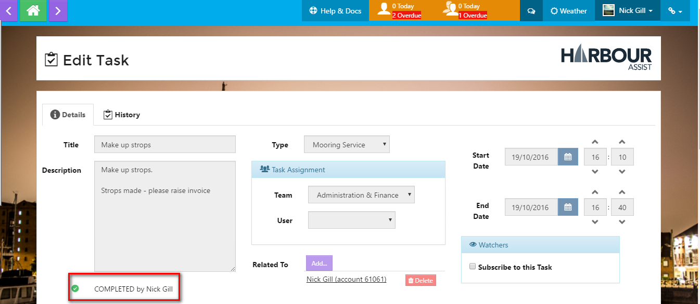

# Tasks \#

## What are Tasks \#\#

Tasks are a 'job, instruction or action' and can be related to any item on Harbour Assist \(Boat, Account, Asset or Order\). They can be used to ask a User or Team to contact the account holder, make changes to an Account or Order, carry out maintenance to an Asset, to alert a user of a problem with an Asset that requires repair etc. They are assigned to a User or a Team and are tracked through to completion.

Viewing the tasks of a User or Team can help with workload management - you can see what they need to do on a daily basis via an outlook-style calendar.

## Task Elements \#\#

There are a number of elememts to a task, some of these should be set when creating a task:-

* Title - this will be set automatically if a Task is associated to a Boat, Account, Asset or Order.
* Type - this should be chosen from the drop down choices.
* Due date - an appropriate due date should be chosen, taking into account working days, urgency of the task and workload.
* Assignment - who the task is for - setting for a User or a Team.
* Association - if a Task is set via an Account, Boat, Asset or Order page it will automatically be associated to that item.  If you wish to manually associate a task to an item  this can be done by selecting the _'Add'_ button and then searching for the Boat, Asset or Customer Name and selecting _Save_.   

* History - all changes made to a Task are logged in the Task History.  To view the History of a task select _History_ at the top of the Task.

The full History of that Task will be shown.

Please see _Creating a Task for an Account_ and _Creating Other Tasks_ for more detailed instructions on setting tasks.

## Managing Tasks \#\#

To manage the tasks that you have been set - click on the orange task section at the top of your page - this will show you a brief description of the tasks set for you and your team and you can go to the Tasks Page.

To view a task, click on the _Actions_ button at the side of the task you wish to view, then select _View/Edit_.

This gives you the full details of the task. You can add a note to a task to keep everyone updated. Do this by clicking on the _New Note_ button.

Enter the note detail, then click _Save_. This will put the note on the task, giving the date and time of the note and who typed the note.

A task can be reassigned to another user or team if the need arises - you can edit the description, giving further details, then reassign and reset the end date/time of the task.

Click _Save_ to save these changes to the task.

When all actions are complete, the task should be completed by clicking the _Complete_ button. You will be asked to confirm the action - click OK.

When the task is viewed now, it will show as COMPLETED and by whom.

## Viewing other User/Teams Tasks\#\#

All tasks that have been set can be viewed by any user.

Click on the **Task** button on the _Home_ page.

The screen will automatically default to show your own tasks, however you can view tasks set for another user or team. To do this, select the user or team by using the drop down boxes and click **Refresh**. This will show all current and overdue tasks for the team/user selected - you can also see completed tasks by checking the _Show Completed_ box. You can have the tasks displayed in either a calendar view or a list view.

The screenshot below is showing all tasks \(including completed\) in a list view.

To see more detail of any of the tasks, click on the _Actions_ button at the side of the task you wish to view, the select _View/Edit_.

You can now see the full details of the tasks and any notes that have been put on that task.

## Task Watching\#\#

At any point during the Task process, whether it be when you are setting a task or just viewing a task set by another user, you can subscribe to 'Watch' the task. This means that each time a change is made to that task \(whenever the title, description, due date or assignment changes\) you will receive an email notification.

To 'Watch' a task tick the _Subscribe to this Task_ box within the _Watchers_ box.

In the _Watchers_ box you can see how many users are watching the task - this is notated in brackets next to the _Watch List_ and by clicking on the _Watch List_ to can see the names of the users who are watching the task.

## Creating a Task for an Account\#\#

From the _Account_ page select **Task**.

Then select **New Task**.

This will automatically populate the account details to that task.

Select the task type, then assign the task to a User or Team.

If you wish to 'Watch' the task, click the box.

Press **Save**.

Enter a description of the task and set the timescale to have the task completed - then press **Save**.

If the task has been set for an individual, they will receive an email notification - both individuals and teams will get a notification at the top of the screen alerting them that they have a task set.

The user below has 2 overdue and 1 current individual task, and the team that he is part of has 1 current team task.

## Creating Other Tasks \#\#

From the **Home** page select the _Task_ button.

Click on the _Create Task_ button.

In the **New Task** screen, enter a relevant title, select the task type and assign the task to either an individual user or a team - then click _Save_.

Enter a description of the task and set an appropriate end date - then click _Save_.

If the task has been set for an individual, they will receive an email notification - both individuals and teams will get a notification at the top of the screen alerting them that they have a task set.

The user below has 2 overdue and 1 current individual task, and the team that he is part of has 1 current team task.

