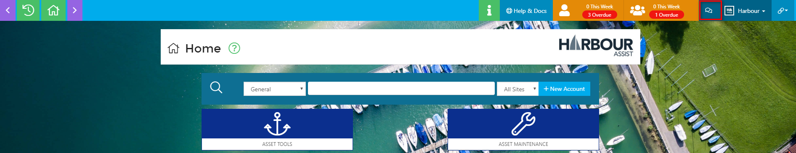
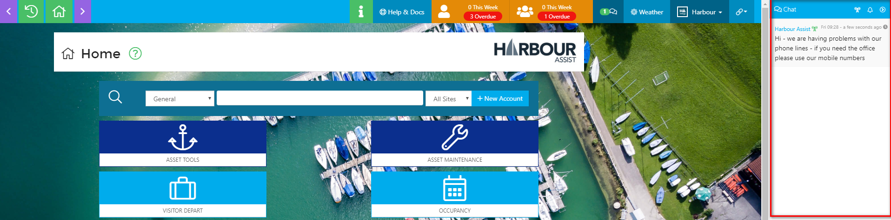
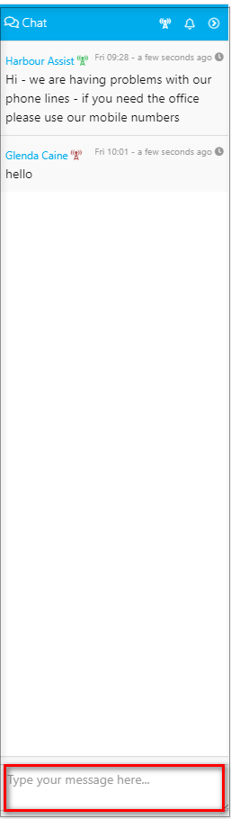
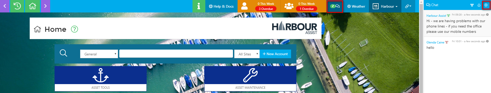
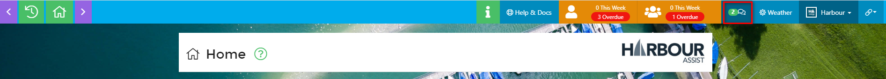
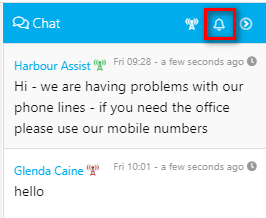
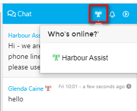

# Chat

## Using Chat \#\#

Harbour Assist has a _Chat_ function, which is particularly useful in the early days of using the system - you could ask a question to see if any other users can help you, for instance.

!&gt; Please bear in mind that conversations are visible to all users and comments cannot be deleted - **SO BE CAREFUL WHAT YOU ARE SAYING!**

To open _Chat_, click on the icon at the top of the screen.

This will open the _Chat_ on the right hand side of your screen.

Type your message in the _Type your message here_ box and press enter - **remember this is visible to everyone**.

You can leave _Chat_ open, although this may restrict the view of other items on your screen, or you close the window by either clicking the arrow at the top or on the _Chat_ symbol.

If you have closed _Chat_ and a new message is put into the _Chat_ you will hear a 'ping' and the _Chat_ icon will show a new message has been received.

If you wish to turn off the sound, this can be done by clicking the bell symbol at the top of the _Chat_ screen.

You cannot send a private message to an individual user - all messages can be seen by all users, so if you intend the message to be for 1 person in particular please ensure you make this clear within the message.

## Who is on-line? \#\#

You can see who is online from the _Chat_ screen. Click on the radio mast symbol at the top of the _Chat_ screen and a list will appear.

To clear this, just click on the symbol again.

