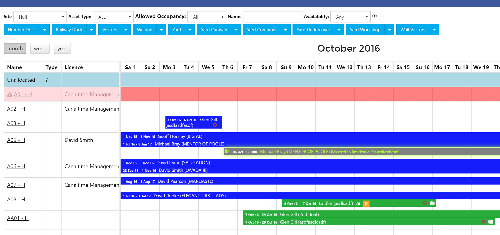
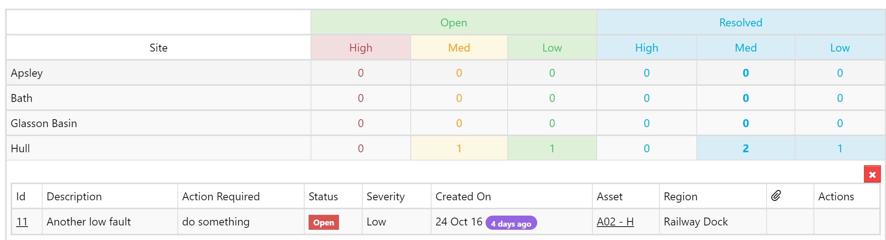

# 2016.3

## v2016.3 - November

A significant release which provides improved support for for multi-site and more complex customers.

### Multi-Site support

Each instance now allows for multiple sites. Each Account belongs to a _single_ Site, and each Asset also belongs to a single Site.

User permissions are built into this, so users can only see Accounts that relate to their site\(s\).

### Occupancies

A major limitation prior to this release was the way a Visitor or Resident location was explictly tied to a single Order that was placed. This caused issues if someone wanted to move halfway through their stay and offered no support for Assets being occupied that didn't need an order. This limitation has been removed by the introduction of _Occupancies_. An Occupancy is simply the occupation of an Asset between 2 dates. This allows us to display a true Occupancy Calendar show who was on each Asset at any point in time.

Each Occupancy can be optionally associated with an Order, so we can

* Show how much is owed when looking at the list of Assets or in the Occupancy Calendar.
* Support for Visitors moving during their stay, in addition to providing the ability for them to move to a differently-priced Asset and the Order auto-calculating if basedon Length or number of nights.

### SMS integration

SMS is now supported for both ad-hoc Communication to Accouts as well as bulk communications via Smart Lists. This provides superb "immediate" notification capability in emergency/unforeseen scenarios. SMS credits start from 4p each.

### Pricebooks

Hand-in-hand with multi-site enabling of HA, we needed the ability to allow different Sites to price their tariffs differently. Whilst we could have just duplicated Tariffs, for large customers, this would soon get out of unwieldly, so we have implemented _Pricebooks_ and completely decoupled Tariffs from their Price\(s\). Using Pricebooks allows you to.

* Have different prices for the same Tariff for different Sites.
* Control how new prices are released - you can prepare next year's pricing in a controlled manner \(i.e. Clone your existing prices with a % increase - a supported feature\), and _release_ this updated Pricebook at exactly the right time.
* Generate renewals using Pricing that isn't yet availble to the rest of the system; it's a common use-case to send out a renewal invitation based on next year's pricing without allowing current users to see these.

### Asset Inspection improvements

We have extended the Asset inspection mechanism in the following ways:

* Created the concept of _Inspection Regimes_ which describe all the different inspection schedules needed for a given Asset \(e.g. Weekly, Monthly, Annual\).  
* For each of these scheduled _Inspection Types_ you can now configure what information needs to be captured, e.g. on a weekly inspection you may want to Grade the asset from A-C via a dropdown and also tick box indicating that the inspector has checked all is Safe.  All this is configurable by Administrators.
* Created a central _Inspection Manager_ page that allows you see in one place what Inspections are overdue, upcoming and completed.

* Integrated Inspections with the Task Engine, so Teams/Users are informed about inspections in the same way as their for other Tasks.

### Fault Management

In addition to improving Inspection Scheduling & capture, we have added the ability to log Faults against Assets and enter information like Severity, Actions required. Faults can be managed via a central _Fault Manager_ page which allows all Faults \(both _Open_ and _Resolved_\) to be reviewed and managed.

### Smaller Changes

* Assets can now be licenced to Accounts as well as Boats.  This is defined at the "Asset Type" level.  This provides the ability to associate non-water-based resources \(e.g. Lockers, beach huts etc\) to People rather than Boats.
* Assets can be marked as "Unusable" and this is reflected appropriately in the Asset list and Occupancy Calendar.
* You can now "subscribe" to a Task, in which case you get an email whenever the Task is rescheduled, re-assigned or completed.  Useful if a manager would like to be kept 'in the loop' on an important job.
* Data upload tools; end users can now bulk-upload Assets, Accounts & Payments.  This streamlines both the onboarding of new customers, but also allows finance teams to upload bank feeds \(with the appropriate data cleansing\).
* System can now be configured to send outgoing emails from the personal email of the user rather than a single central email address.

