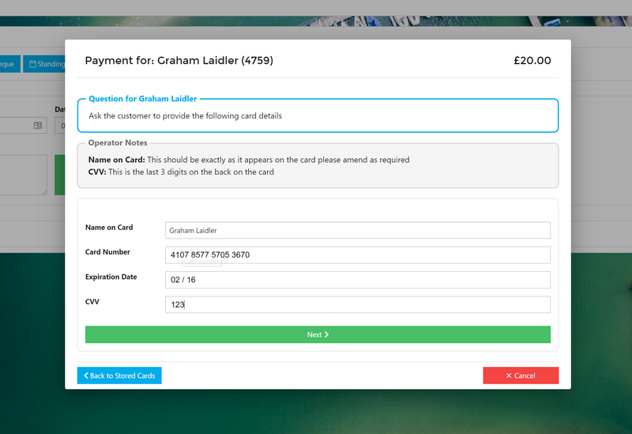
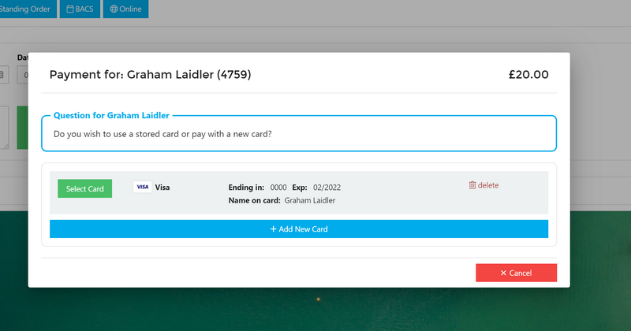
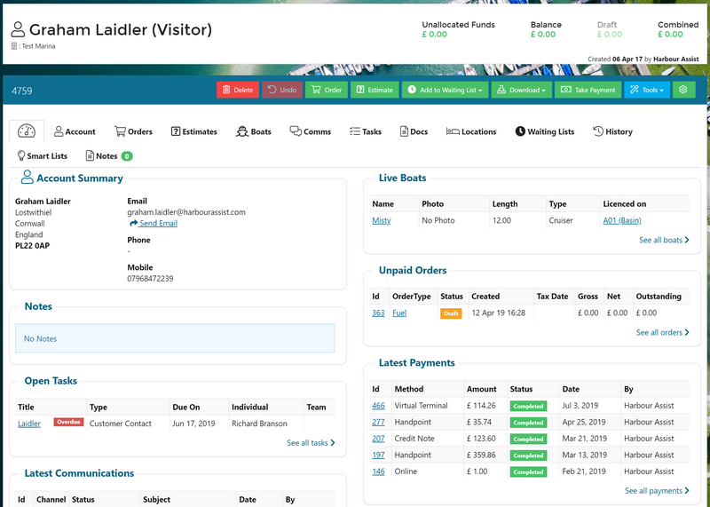

# 2019.2

## v2019.2 - July \#\#

A significant release, with several new payment options.

## Phone Payments / Virtual Terminal \#\#

Over-the-phone payments are typically made by finding the customer & Order in Harbour Assist, entering the correct amount and card number into a PDQ machine, then feeding the authorisation code back into Harbour Assist for reconciliation. Our new Virtual Terminal eliminates this; the credit card number capture can be done seamlessly within Harbour Assist, with no dual keying:

* Payment made via PaySafe's secure infrastructure.
* 100% PCI compliant.
* Amount and auth codes are handled for you - no more typos or wrong amounts entered.
* Payment is automatically allocated to the correct orders.

### Card Vault Integration \#\#\#

We have also integrated the Virtual Terminal with PaySafe's Card Vault, so customers can opt to store their card securely, ready to be re-used for future payments \(either via the Phone or Online\).

## Mobile Payments - Handpoint \#\#

Many of our customers use PayPal Here as a mobile payment solution. Whilst this is integrated with HA, there are a number of limitations:

* Only works on iPads and not Office-based PCs.
* PayPal's login requirement is "annoying" to say the least.
* The integration is very loose; the users need to remember to hit the "new sale" button in Paypal App, and it creates lots of tabs in Safari.

We have found a better solution, **Handpoint**. This has a similar card-reader, but integrates more tightly with Harbour Assist and addresses all of these weaknesses.

* It can be used instead of PDQ machines in the office for Cardholder Present transactions.
* It can be used on the water for Chip and Pin and Contactless Payments.
* Anyone using HA can use it, no external logins need to be managed.
* All transactions are reconciled in Harbour Assist automatically.

**With PaySafe Online, PaySafe Virtual Terminal and Handpoint, we now offer all-channel payment options.**.

#### Advanced Notice: PayPal Retirement \#\#\#\#

All the features above are only available to PaySafe customers. PaySafe features such as Virtual Terminal and Card Vault are industry-leading, and support our vision to provide the most frictionless payment options for your customers and staff. _On top of this, it's cheaper than PayPal._

For these reasons, we will be retiring both PayPal Here and PayPal Online in a future release. So for those of you still using these, please get in touch to discuss migrating. Onboarding to PaySafe is quick and painless.

## Account Dashboard \#\#

The Dashboard brings important information from across the multiple Account Tabs onto one page. The goal is to give you the information that is important with fewer clicks.

Some of you will already see this, but if you don't see it and would like to have it please ask the person responsible for configuring Harbour Assist and we'll gladly enable.

## Reporting \#\#

* Reports can now be emailed directly while viewing it.  Just click on the _Envelope_ icon.
* More polished parameter interface.
* Parameter area can be dragged to make larger/smaller.
* A number of reports now support multiple parameter selection.
* Aged debt reporting performance improvements.

## Other Changes \#\#

* Customers can now administer their Vaulted Cards via their Portal \(in addition to over the phone using Virtual Terminal\). _NB: Only available to PaySafe customers._
* Meter readings are now "Drawn-down" as multiple lines so that gaps in readings are easier to account for to the customer.
* Mapping marker colour and popups now reflect modifications to the start/end dates in the top toolbar, so you can see availability accurately.
* Users can now be made "Inactive" and "Active" rather than only being able to Delete them; this makes seasonal staff easier to manage.
* _Visitor Depart_ now allows sorting by any column.
* New look User admin page.
* You can now email Credit Notes.
* You can now filter an Accounts' Communications by Channel 
* You can now search an Account's Communications subject\(s\) to help find that elusive email.  We hope to offer full-text searching and pdf indexing in the future, but this is first stage.
* Smart Lists table now shows the number of matching records.
* Users can't be deleted or made inactive if they have Active Tasks.
* Estimates now show boat length and support related Boats.
* Visitor Depart now remembers the Occupancy Type you last selected.

