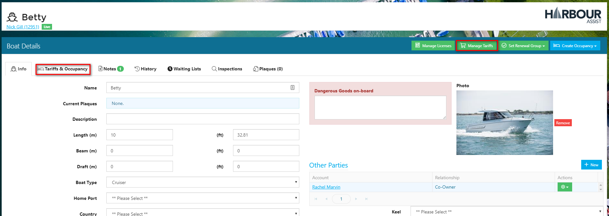
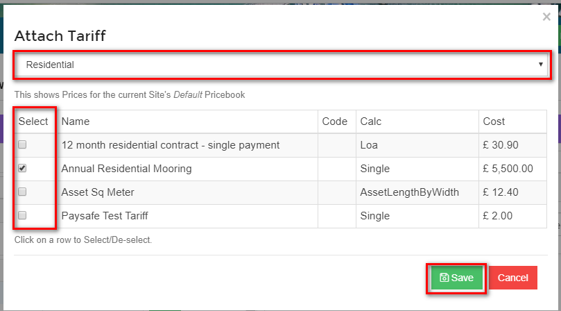
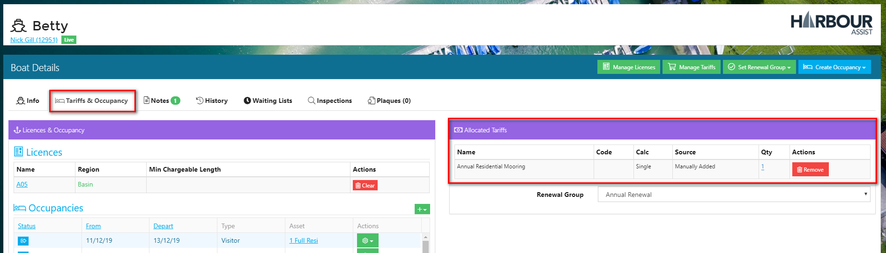
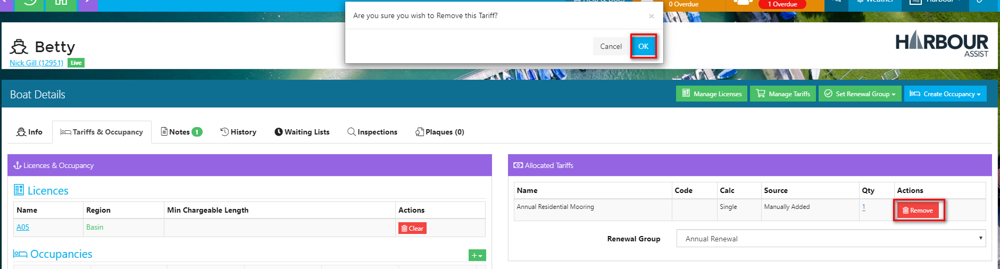

# Allocating Tariffs \#

## Overview

In order for the Renewal engine to work correctly each boat requiring a recurring contract that will be part of an Batch Renewal Run needs to be Licensed to an Asset, have one or more Tariffs allocated to it and be assigned to a Renewal Group.

?&gt; For more documentation about Licensing click [here](https://github.com/glaidler/docs-1/tree/a9b2fde53025657e319d99966ea9a02a32cbd61d/Renewals/Renewals/Licensing/README.md).

?&gt; For more documentation about Renewal Groups click [here](https://github.com/glaidler/docs-1/tree/a9b2fde53025657e319d99966ea9a02a32cbd61d/Renewals/Renewals/RenewalGroups/README.md).

The Batch Renewal Run will automatically charge the amount of the Tariff\(s\) that are allocated to the boat.

It is best to allocate the Tariff\(s\) to a boat at the point of setting up the account and boat details.

## Adding Tariffs to a Boat

To add a Tariff to a boat, from the Dashboard screen select the boat by clicking on the boat name or using the _Boats_ tab.

If you have used the Boats tab, select the boat by clicking on the boat name.

Now click on _Manage Tariffs_.

?&gt; NB: If you want to view any current Tariffs, click on the _Tariffs & Occupancy_ tab to see this.

Using the drop down arrow, select the category of Tariff you wish to add.

All Tariffs which are in the category selected will show and you can add or remove a Tariff by checking the box.

Remember you can add more than 1 Tariff to a boat - each Tariff will show on a separate line on the Renewal Order.

Once you have selected the Tariffs, click _Save_.

The Tariffs that have been allocated to the boat are now listed in the _Allocated Tariffs_ section.

## Removing Tariffs from a Boat

To remove a Tariff from a boat, simply click on the _Remove_ button - you will be prompted to confirm your action - click OK.

