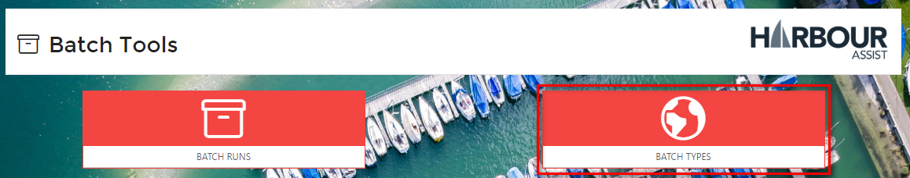
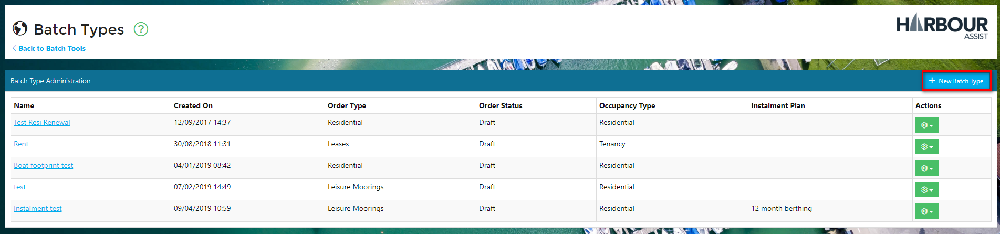
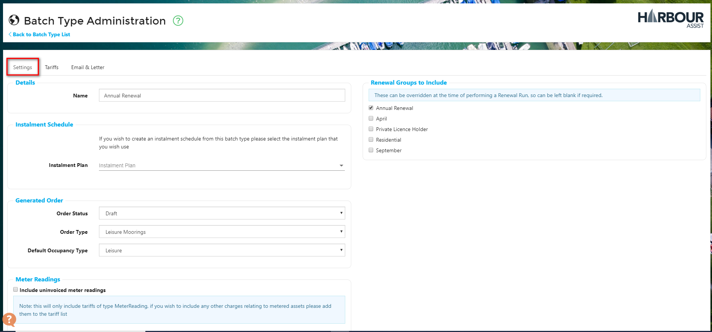
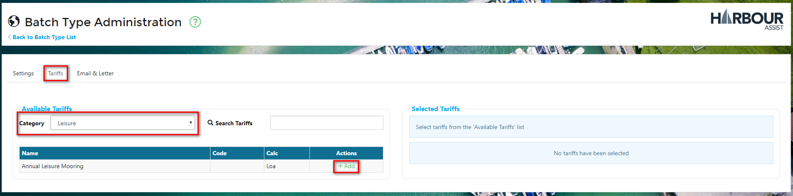
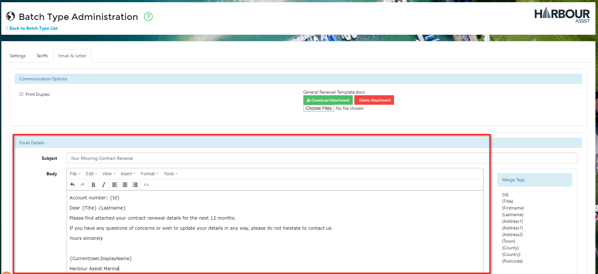

# Batch Types \#

In order for a Batch Renewal Run to be created, there needs to be a _Batch Type_ set up - this will form the basis of the Batch Renewal Run.

To set up a _Batch Type_, from the _Home_ screen select _Batch Tools_.

Then select _Batch Types_.

Click on _New Batch Type_.

## Settings

In the _Settings_ tab of the _Batch Type Administration_ screen, you now need to complete the details:-

* Give the Batch Type a name,
* Set the Instalment Schedule, if required \(only for contracts that are payable over instalments\).
* Set the Order Status of the renewal.  It is advisable to set this to _Draft_ \(proforma\), as the orders created can then be edited if any changes need to be made without having to raise a credit note, 
* Set the Order Type, 
* Set the Occupancy Type - this is optional - there may be instances where you do not want to create an occupancy \(membership renewals is an example of this\).
* Include uninvoiced meter readings, if required.
* Set the Renewal Group to include - this is optional as it can be set when performing a Batch Renewal Run.

## Tariffs

Now you need to select the Tariffs to include - as this example is for Leisure customers, we have selected the Leisure category.

This will show you a full list of the Leisure Tariffs that are set up in the system. To include a Tariff, simply click on the +Add button. As you select each Tariff you will see it appear in the _Included Tariffs_ list. You can remove it by clicking on the trash button.

## Email & Letter

The next stage is to upload a Renewal Letter and Order/Invoice template.

This document can be bespoke and should be created in Word - we have a standard template that you can base this around, please contact us by raising a Help ticket if you need this sending to you.

This will be be document that is emailed to a customer \(as a PDF\) or printed for those customers without email addresses. It is normal to include a covering letter, invoice, terms & conditions of the contract and details of how to make a payment.

Click on _Choose Files_ to upload your Word document.

Now you need to create a covering email - this is what the customer will receive if they have agreed to receive their communications by email. The Renewal Letter and Order/Invoice document will be attached to this email as a PDF.

Give your email a Subject title and then complete the body of the email.

Your _Batch Type_ is now ready for use.

