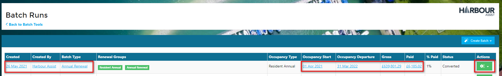

# Bulk Confirming Batch Run Orders

As renewal orders are normally created well in advance of the renewal date, they are sent to the customers as a Draft order, this enables the customer to come back to you with any necessary changes and the changes can be made to the Draft order rather than having to raise a credit note and a new order.

Draft orders will not appear in either your Sales or Debt reports as they do not have a tax point date.

As the orders are paid, they are automatically Confirmed and given a tax point date of the date of the payment and at this point they will show on your Sales reports.

There comes a point in time though where all the remaining unpaid orders should be confirmed so that they are included in both your Sales and Debt reports - this is normally the start date of the new contract/agreement with the customer.

To bulk confirm the remaining orders, from the Home page click on _Batch Tools_.

Then _Batch Runs_.

Open up the Batch Run that you want to confirm by clicking on the any of the text that shows in blue or by using the Actions button and View.

Now click on the _Confirm Orders_ button.

Using the calendar picker, select the date that you want to set as the tax point date of the remaining orders, then click on _Save_.

?&gt; NB. This will not change the tax point date of any orders in the Batch that are already paid and confirmed.

The Confirm Orders and Delete Orders buttons will disappear from the Batch Run as once they are confirmed these options are no longer available.

In your Batch Runs list the status of the Batch will now show as Confirmed and the orders will show in your Sales and Debt reports.

