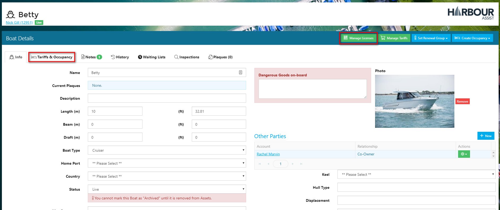
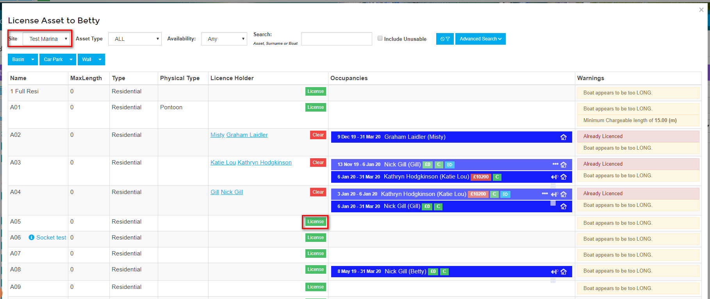
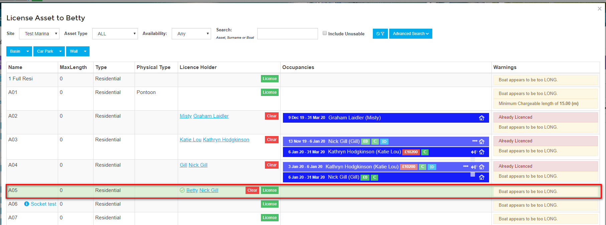
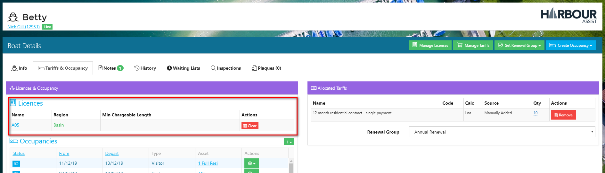
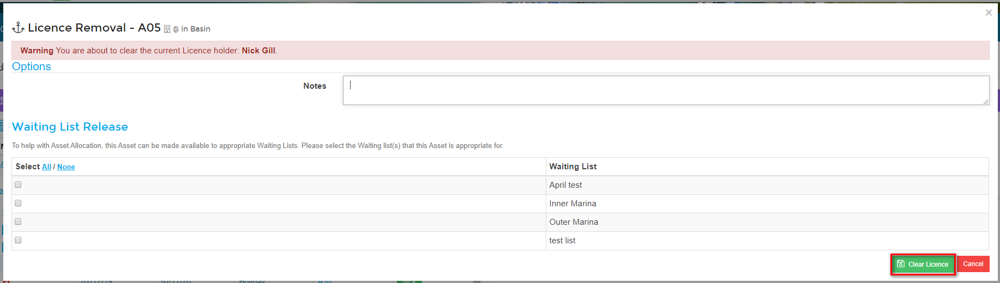

# Licensing \#

## Overview

In order for the Renewal engine to work correctly each boat requiring a recurring contract that will be part of an Batch Renewal Run needs to be Licensed to an Asset, have one or more Tariffs allocated to it and be assigned to a Renewal Group.

?&gt; For more documentation about allocating Tariffs click [here](https://github.com/glaidler/docs-1/tree/a9b2fde53025657e319d99966ea9a02a32cbd61d/Renewals/Renewals/AllocatedTariffs.md).

?&gt; For more documentation about Renewal Groups click [here](https://github.com/glaidler/docs-1/tree/a9b2fde53025657e319d99966ea9a02a32cbd61d/Renewals/Renewals/RenewalGroups.md).

The Batch Renewal Run will automatically create an Occupancy against the Asset that the boat is Licensed to for the specified dates of the Batch Renewal Run.

Each Asset can only have 1 boat licensed to it, however a boat can be licensed to more than one asset. For example, if a boat is taking up 2 berths it could be licensed to both.

It is best to License a boat to an Asset at the point of setting up the account and boat details.

## Adding a License to a Boat

To License a boat to an Asset, from the Dashboard screen select the boat by clicking on the boat name or using the _Boats_ tab.

If you have used the Boats tab, select the boat by clicking on the boat name.

Now click on _Manage Licenses_.

?&gt; NB: If you want to view any current Occupancies etc before setting the License, click on the _Tariffs & Occupancy_ tab to see this.

Find the Asset that you wish to License the boat to - you can do this be filtering on the blue tiles at the top of the screen.

?&gt; NB: For multi-site operators, please ensure you have selected the correct site.

?&gt; NB. if you want to License a boat to an Asset that already has a boat Licensed to it, you will need to clear the License from that boat first.

Select _License_ on the Asset you want to License the boat to.

Confirm your selection by clicking on _License_.

The boat is now Licensed to the berth.

Close the pop-up by clicking outside of the pop-up or using the small x in the top right hand of the pop-up.

?&gt;NB. When moving boats through the Occupancy screen, it is important to also move the License if the move is permanent, otherwise when the Batch Renewal Run is carried out it will revert to the Asset the boat is Licensed to.

## Clearing a License

If you want to clear a License from a boat, in the Licensing section of the _Tariffs & Occupancy_ screen, select _Clear_ on the Asset you want to clear the License from.

You will be given a warning that you are about to clear a license.

If appropriate you can add a note, but this is not a mandatory action.

You can also make the Asset available to a _Waiting List\(s\)_.

?&gt; For more documentation about Waiting Lists click [here](https://github.com/glaidler/docs-1/tree/a9b2fde53025657e319d99966ea9a02a32cbd61d/Renewals/AssetsOccupancy/WaitingLists.md).

Click on _Clear License_ at the bottom of the screen.

You will be asked to confirm your action - click OK to continue.

