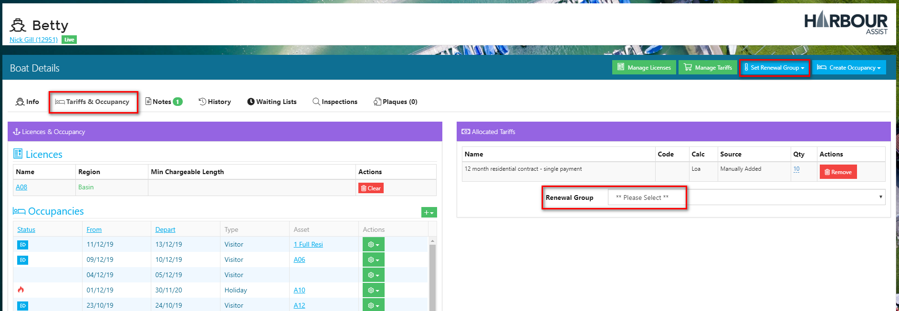

# Renewal Groups \#

## Overview

In order for the Renewal engine to work correctly each boat requiring a recurring contract that will be part of a Batch Renewal Run needs to be Licensed to an Asset, have one or more Tariffs allocated to it and be assigned to a _Renewal Group_.

?&gt; For more documentation about Licensing click [here](https://github.com/glaidler/docs-1/tree/a9b2fde53025657e319d99966ea9a02a32cbd61d/Renewals/Renewals/Licensing.md).

?&gt; For more documentation about Allocating Tariffs click [here](https://github.com/glaidler/docs-1/tree/a9b2fde53025657e319d99966ea9a02a32cbd61d/Renewals/Renewals/AllocatedTariffs.md).

When creating a Batch Renewal Run the _Renewal Group_ is the criteria for selecting the correct group of accounts/boats to have orders raised against them.

Renewal Groups can be set in any way you want depending on how you wish to group together your customers. They could be set up by:-

* Site \(for multi-site operators\)
* Area
* Account type
* Order type
* Month etc. 

Renewal Groups are set by using a _Lookup_ list and can be added to and amended at any time.

?&gt; For more documentation about Lookups click [here](https://github.com/glaidler/docs-1/tree/a9b2fde53025657e319d99966ea9a02a32cbd61d/Renewals/Administration/Lookups.md).

Each boat can only be in one boat _Renewal Group_.

It is best to assign a boat to a _Renewal Group_ at the point of setting up the account and boat details.

## Adding a Renewal Group to a Boat

To assign a _Renewal Group_ to a boat, from the Dashboard screen select the boat by clicking on the boat name or using the _Boats_ tab.

If you have used the Boats tab, select the boat by clicking on the boat name.

Select the _Renewal Group_ by using the drop down options in either the _Set Renewal Group_ or within the boat details itself.

Alternatively, you can set the _Renewal Group_ from the _Tariffs & Occupancy_ screen at the same time as Licensing the boat and allocating the Tariffs.

