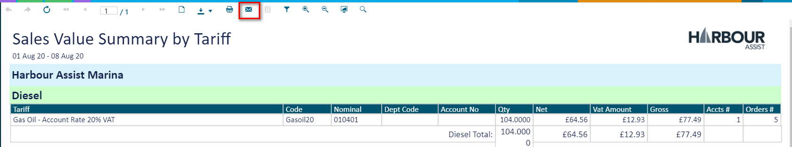
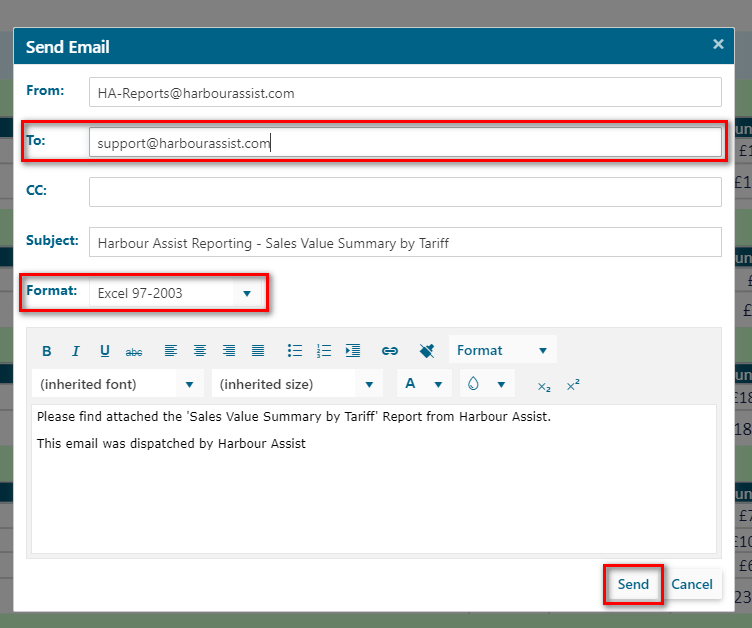

# Emailing Reports

Reports can be emailed directly from Harbour Assist, removing the need to download, save and attach to an email.

To email a report click on the Envelope icon within the report.

Populate the _To_ box with the recipients email address and select the _Format_ you want the report to be. You can also edit the covering message if you wish.

Then click on the _Send_ button.

?&gt; NB. The _To_ cell will default to the users email address, so be sure to change this if you are not sending the report to yourself.

