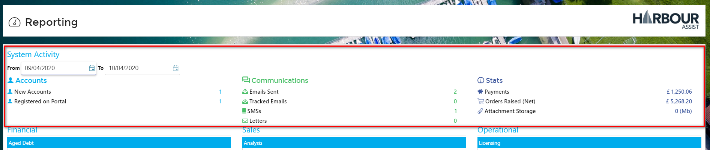
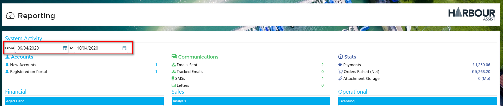

# System Activity

Within the Reporting section you can view high level System Activity.

This will default to the current days activity, but any date range can be set by using the date pickers.

?&gt; NB. The _Orders Raised \(Net\)_ figure is for confirmed orders only ie. those with a tax point date.

