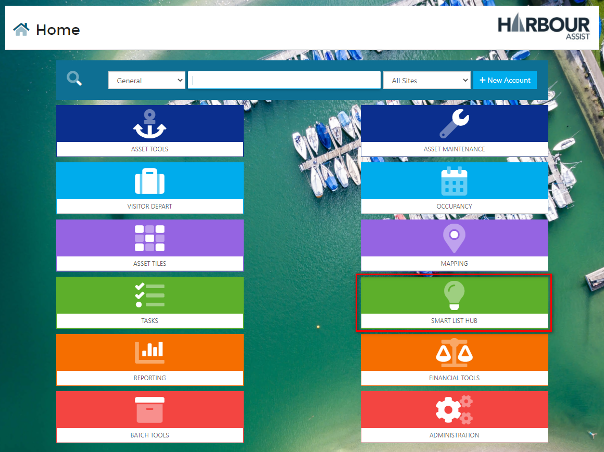
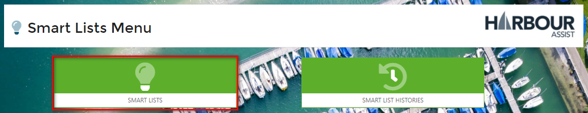
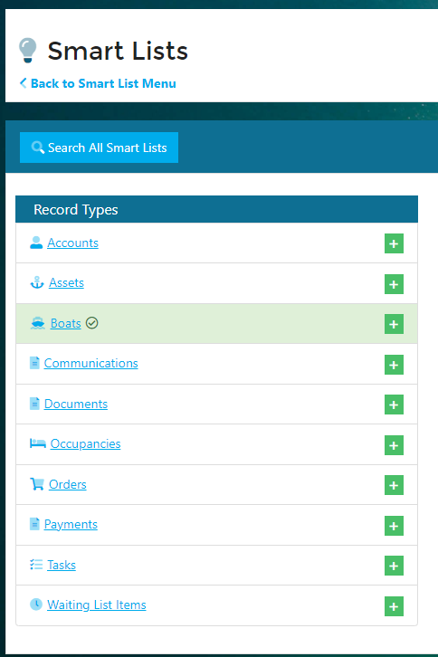
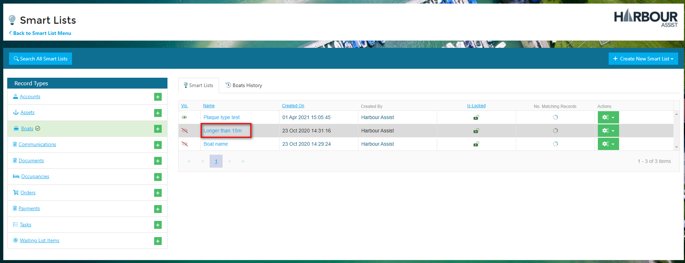
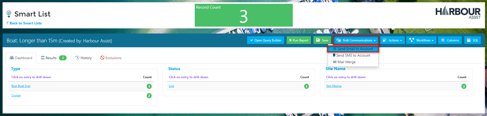
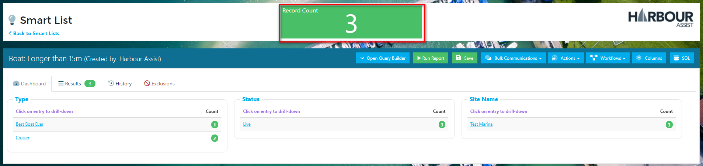
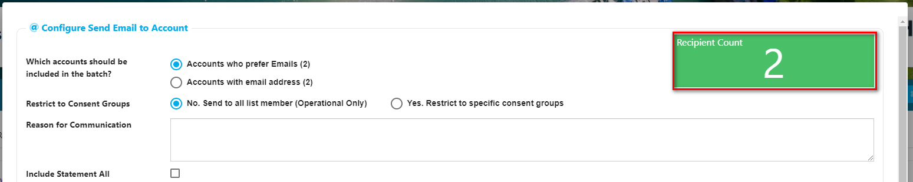
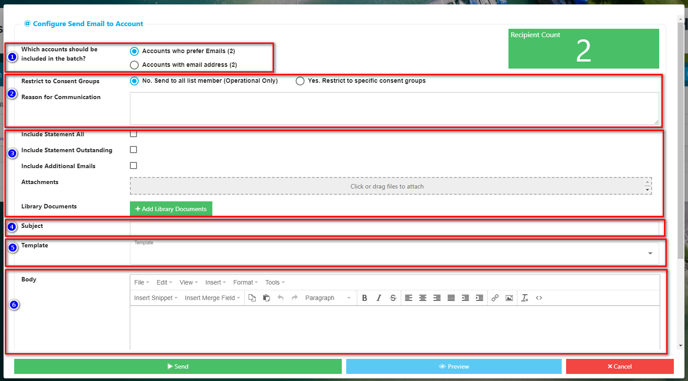
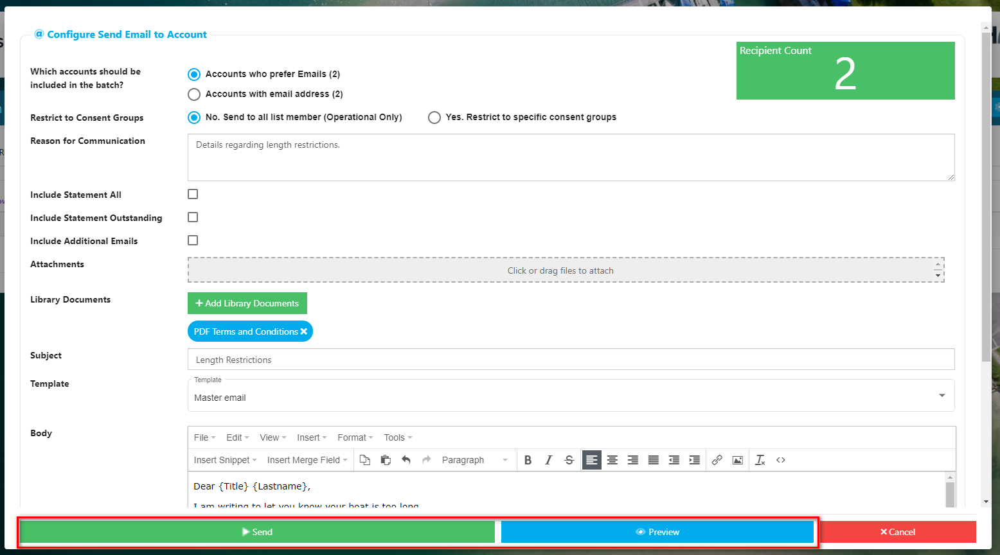
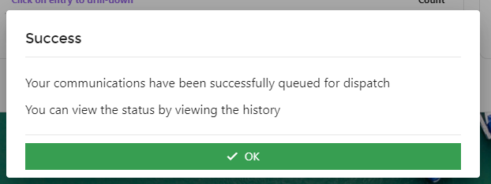

# Sending a Bulk Email Communication ddddd

The Bulk Email function allows you to send Emails to all the members of a Smart List.

From the _Home_ screen click on _Smart List Hub_.

Then within the Smart Lists menu choose Smart Lists.

Find the Smart List that you want to use by clicking on the relevant Record Type name or using the Search All Smart Lists button.

Then open up the Smart List by clicking on its name.

Using the _Bulk Communications_ dropdown select _Send Email to Account_.

?&gt; NB: The list I am using has a Record Count of 3, however only 2 of these Accounts have an email address.

This is indicated in the email composer pop-up.

Complete the following steps:-

1. Who should be included in the communication.
2. Is this an Operational or Marketing communication? - remember if it's Marketing you should only send to those who have opted in to receive the communications. You will be prompted to either give an Operational justification or to choose which Consent Groups the communication should go to.
3. Inclusions and Attachments - 
   * Do you want to include additional email addresses that are on Accounts - if so tick the box.
   * Add any attachments that need to be sent with the email.
4. Give your email a subject - this will be displayed to the customer, so make sure it's something sensible.
5. Choose which template to use if you want to use one.
6. Create the body of your email.

You can preview your emails by clicking on the blue _Preview_ button and once you are happy click _Send_.

A confirmation of the send will pop up on your screen.

