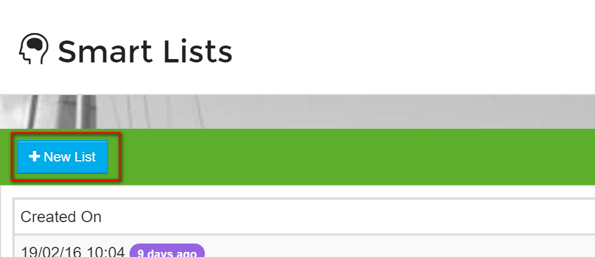
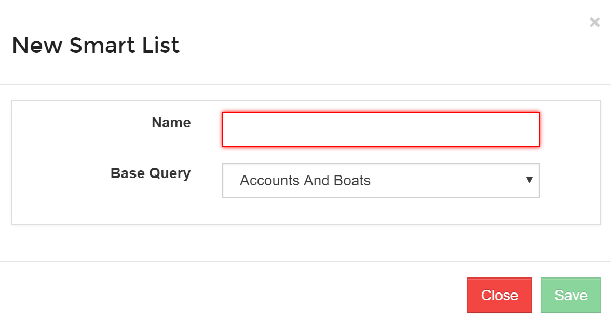

# Creating a Smart List

* Navigate to the _Smart Lists_ page from the _Home_ Page.
* Click on the _New List_ button.

* You will be prompted to give the new Smart List a name.  Enter a name and click on Save.

You'll see a dropdown for **Base Query** please ignore this. This is there so we can expand the flexibility of Smart Lists in the future.

You have now created a new Smart List - this list currently will include all Accounts, so now you need to set some parameters for this list by Editing it.

