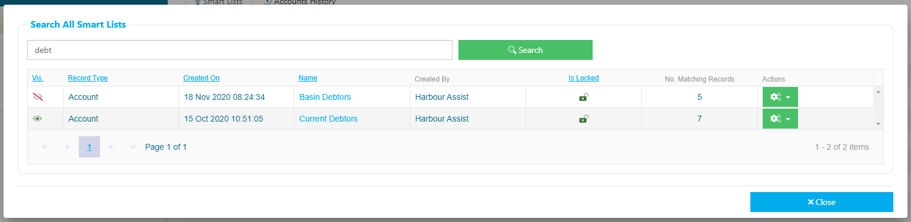

# Creating a Smart List

To create a Smart List, from the _Home_ page, click on **Smart List Hub**.

Then choose **Smart Lists**.

Now you need to decide which records type you want to create the Smart List for. Think about what detail you are trying to find or which group of customers you want to contact, here are a few examples and which type of List to create:-

* To send an email to the owners of all boats that are currently occupying a berth or occupied a berth during the last month etc - you need to create an _Occupancy_ Smart List,
* You want to find all boats over a certain length, or of a particular type - you need to create a _Boats_ Smart List,
* Maybe to want to request customers to send you their up to date boat insurance certificate - create a _Documents_ Smart List.

?> Top Tip: Because Smart Lists are always up to date, you can use the same list over and over again; there's no need to create a new one each time, so before you create a new list check whether one already exists by using the search function.

To create a new Smart List you can either click on the + button against the Record Type that you want to use or select from the drop down options that show then you click on _Create a New Smart List_.

Both ways will take you to the _Query Builder_ page.

?> NB: The Criteria of **Account - Status > Equal > Live** is now added by default - if you **do** wish to include Archived Accounts you can remove this by clicking on the _Bin_ icon.

Now you can start to build you list by adding the _Criteria_. Click on either the _+Add Criteria_ button or the _+Add First Criteria_ button to get going.

In this example I am creating a _Tasks_ Smart List. I want a summary of all _Customer Contact_ tasks that have been created since 1st January this year.

First I add the _Task - Type_ criteria,

Followed by the _Task - Created on_ criteria.

Once you have added all your Criteria click on any of the _Query Updated - Run Report_ buttons.

?> NB: When changing the smart list criteria the report no longer updates with every change. When you have changed, added or removed any criteria you now have to hit the "Run Report" button to update the results. This change means that Smart Lists are now much quicker to load!

The page will display the record count results in the big green box at the top of the page and at the bottom of the page you will see a dashboard summary of the results. The results that are displayed will depend on the type of Smart List you are creating.

If you want to add any of these results to the Criteria of the list, just click on the name - For example, what if I forgot that I only wanted to see Completed Tasks, and didn’t set that Criteria? Clicking on the _True_ in the _Completed_ results will add that Criteria to the list for me. You just have to remember to hit the **Run Report** button again.

Now you have you List you need to Save it. Click on the Save button.

Give your list a name \(remember to give it a sensible name so that other users can find it if they search\), decide whether you want the list to be Private or Public and then Save or Save & Lock.

?> NB: If you Lock a Smart List only Users with the Permission of **SmartListAdministrator** will be able to unlock it.

