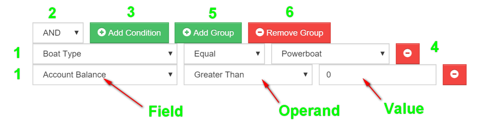
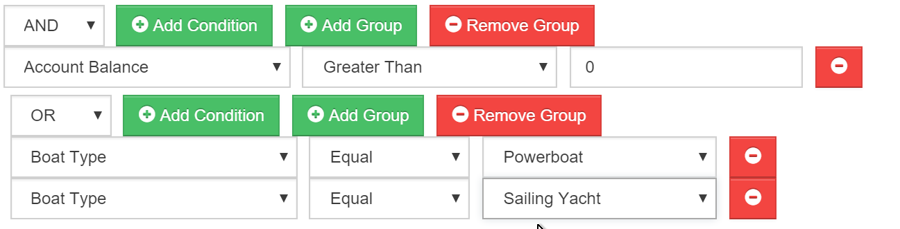

# editing

## Smart List Editing

By editing a Smart List you are setting the parameters of the list - ie. you are filtering down your whole Account database until you are left with the group of Accounts you require.

If you have suitable permissions, when viewing a Smart List, there will be an _Edit_ button. Clicking on this will show the Query Editor.



### 1. Conditions

Each of the rows labelled "1" are Conditions, and each of them restrict the number of records returned when the Smart List is run.

In the scenario shown, there are 2 Conditions;

* Boat Type Equals Powerboat
* Account Balance greater than 0

Each Condition contains 3 elements; _Field_, _Operand_ and _Value_.

**Field**: These are the Account fields that can be used to build the Condition.

**Operand**: These are terms such as "Greater Than" or "Starts with" that will help you refine how the Value is used to filter the Accounts. The values in this dropdown will depend on the type of data stored in the selected Field. For example, "Greater Than" will only appear on numeric fields as it doesn't mean anything if you've selected a Text-field \(like 'Surname'\).

**Value**: This is the criteria that you want to look for. Whether this is a dropdown or a text box will depend on what Field you have chosen and whether the Operand needs more information. Again, playing with this is the best way of understanding it.

### 2. Operator

This defines whether **all** the _Conditions_ need to be met for an account to be considered as a member of this Smart List, or **any** of them. The easiest way to imagine this is build a sentence in your head whilst reading the Conditions from top to bottom.

Start with the phrase "Give me all Accounts that the following is true", then read the conditions from top to bottom, and put the Operator in between them. In the scenario above, the Operator is **AND**, so reading the Conditions from top to bottom gives us:-

```text
   Give me all Accounts that the following is true:

    *  Boat Type Equals Powerboat

    AND

    *  Account Balance greater than 0
```

This Smart List would only return Accounts that have **BOTH** a Powerboat and an Outstanding Balance. An Account who owned only a Sailing Yacht and owed money would not be returned as their record doesn't match **ALL** of the Conditions.

Consider if we changed the Operator to **OR**.

```text
   Give me all Accounts that the following is true:

    *  Boat Type Equals Powerboat

    OR

    *  Account Balance greater than 0
```

This drastically changes things, as it would return all Powerboat owners \(regardless of whether they owe money\). On top of this, it would return all Accounts that owe money \(regardless of what Boat they own\). By changing this, you would expect the number of records returned to increase.

### 3. Add Condition

You can add as many Conditions as you please, just hit the _Add Condition_ button and a new Condition row will appear.

### 4. Remove Condition

This button will remove the Condition that the button is next to.

## Advanced Scenarios

It might not be sufficient to only treat the entire Query as **AND** or **OR**, you many want to build a complex idea like _"I want to see all Accounts who owe money and who own either a Powerboat or a Sailing Yacht"_.

This is where Groups come into it. A Group is a set of Conditions with an appropriate Operand. Indeed the scenarios we've described above is a single Group. By adding more Groups, you can build Queries with far more complexity.

The image below shows the example we gave above.



You can treat a Group as a standalone Query, where only the results are fed into the Group above.

In this scenario, if we treat the 2nd Group as a standalone Query, and use our plain english sentence as we did perviously, we get:

```text
  Give me all Accounts that the following is true:

    * Boat Type Equals Powerboat

    OR

    * Boat Type equals Sailing Yacht
```

.. and if combined with the Outer Group, we can just use a phrase "the Account is in" to help combine them into a plain English sentence that is easy to understand:

```text
  Give me all Accounts that the following is true:

    * Account Balance is Greater Than 0

 AND 

    the Account is in:
    [

    Give me all Accounts that the following is true:


    * Boat Type Equals Powerboat

    OR

    * Boat Type equals Sailing Yacht


    ]
```

Combining Groups can be complex to understand, so if you need help just drop us a message via the Question Mark in the lower-left of Harbour Assist and we'll be happy to help.

