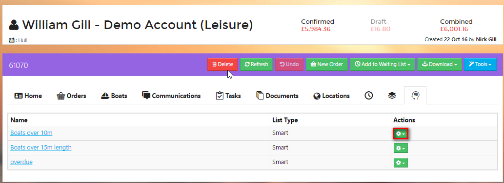

# Exclusions \#

_Exclusions_ are people who _should_ be on a Smart List, but have been explicitly removed.

## How to Exclude an Account from a Smart List \#\#

From the Account page, select the Smart List tab.

This will display all the Smart Lists that the Account is currently included in.

Click the _Actions_ button on the line of the Smart List you wish to exclude the Account from.

Click on _Exclude_.

The screen will now show that the Account is Excluded from that Smart List.

If you wish you undo the exclusion at any time you can do this by clicking on the _Actions_ button and selecting _Undo Exclusion_.

You can see who has been excluded from a Smart List by clicking on the Exclusions button when viewing a Smart List.

From the Exclusions page, you can remove Accounts from the Excluded list.

?&gt; NB: They will only re-appear on the Smart List if their Account data fits the criteria of the Smart List.

