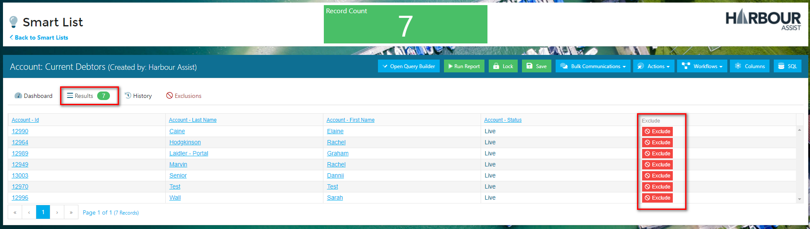
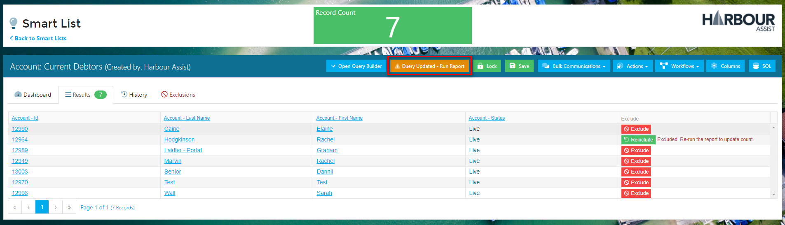
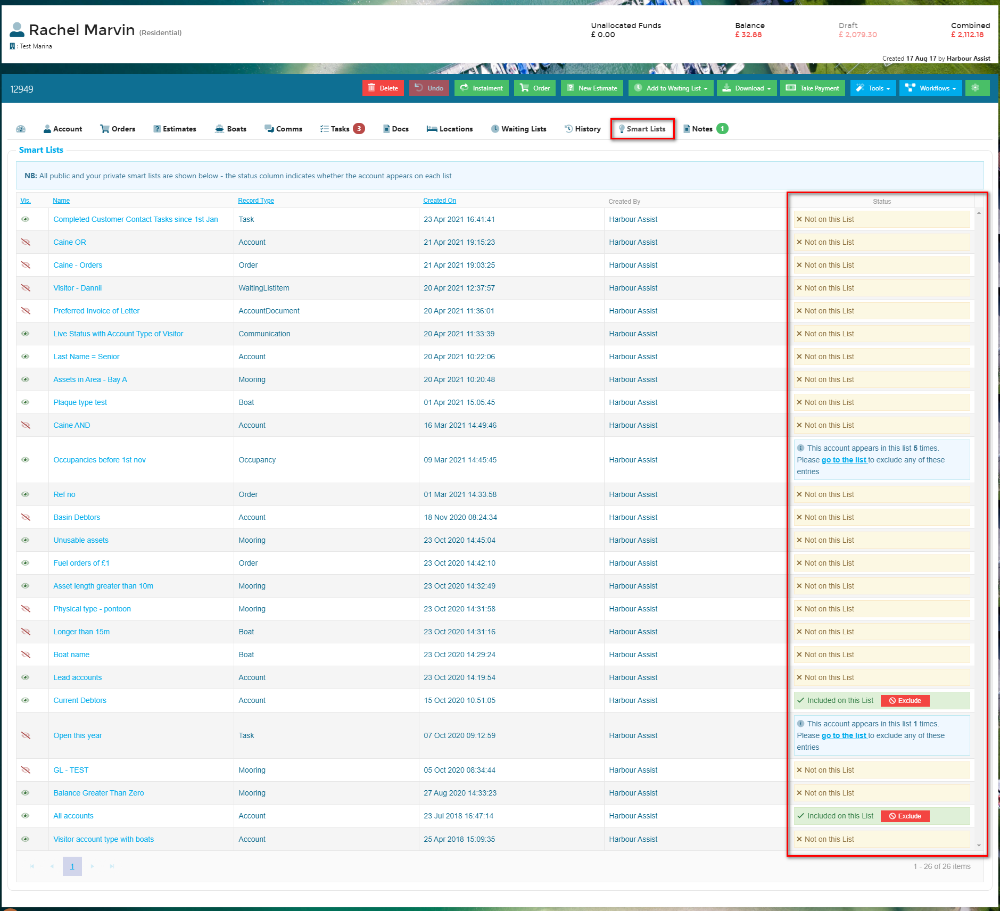
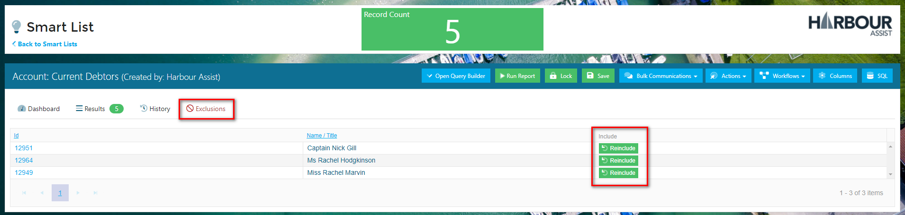
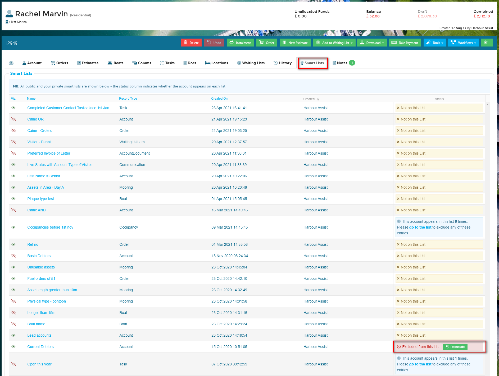

# Exclusions \#

_Exclusions_ are people who _should_ be on a Smart List because they meet the Criteria that have been set, but have been explicitly removed.

There are 2 ways that you can exclude an entry from a Smart List:-

* Via an individual Smart List
* By using the Smart List tab on an Account.

## Excluding an entry from an individual Smart List

Open up the Smart List and click on the _Results_ so that the detailed results are visible. Then click on the _Exclude_ button on the line of the account you want to exclude.

?&gt; NB: Remember to _Run Report_ when you have made any changes.

## Excluding via the Smart List tab

Within the customer account, click on the Smart List tab. All public and your private smart lists will show - the _Status_ column indicates whether the account appears on each list.

For Smart Lists that are created using the Record Type of Account, if the Account appears on the List the _Exclude_ button will be visible so you can exclude the entry from the list.

For all other Records Types the Account could potentially appear multiple times on the same list - for example, a Tasks list - if there is a list created to show all open tasks and the account has multiple open tasks it will appear on the list multiple times. In cases like this you should click on the _go to the list_ link and exclude each of the entries you do not want to be included.

## Viewing Exclusions & Re-including Entries

To view Exclusions on a single List, open up the Smart List and click on the _Exclusions_ tab. All the Exclusions will display and you can click on the _Reinclude_ button to reinclude them on the List.

To view Exclusions for a particular Account, click on the Smart List tab and the Exclusions will display in the Status column. Click on the _Reinclude_ button to reinclude them on the List.

