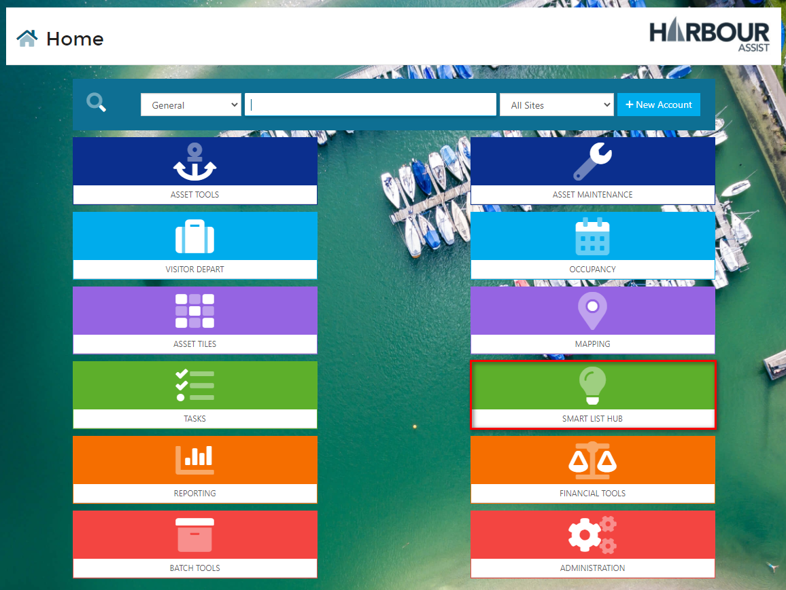
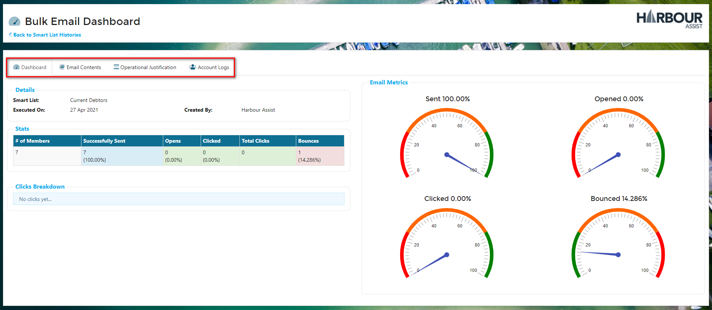

# Smart List History

It's really useful to be able to see the details of bulk communications that have been sent via a Smart List. You've always been able to see this against an individual Smart List, but we've been contacted many times by users saying 'my colleague sent a communication last week and I need to send a follow up, but I don't know what Smart List they used', so we've added a new tile that shows the history of all Smart Lists in one place.

From the _Home_ page click on _Smart List Hub_.

Then _Smart List Histories_.

All the Actions for all Lists will display in date order with the most recent at the top.

You can filter the results by the _Record Type_ of the List and by the _Action_ that was carried out.

Click on the magnifying glass symbol to see the details of the Accounts that were included in the communication.

For bulk emails you can also view further details by clicking on the dashboard symbol.

Here you will see the delivery statistics, on the Dashboard Tab and you can also view the Email Contents, the Operational Justification and details of the Accounts the email was sent to by click on the other Tabs.

You can of course still view all this detail from within an individual Smart List - just click on the History Tab within the list to see the history for that list alone.

