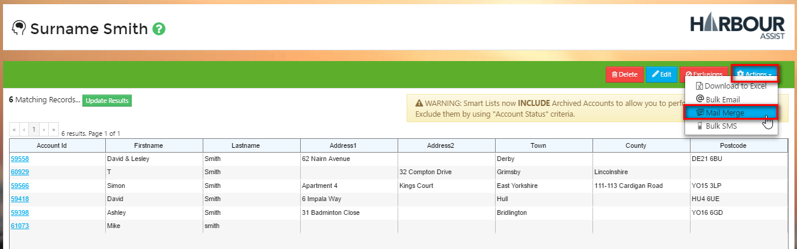
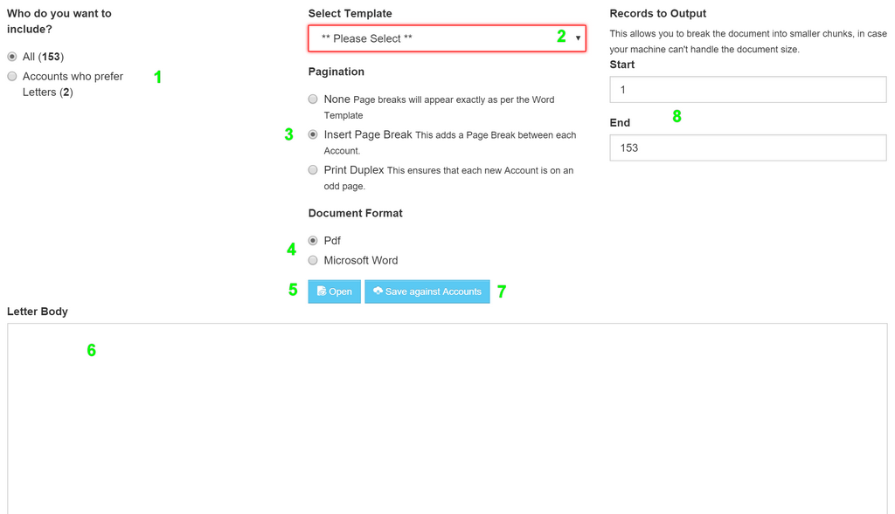

# Sending a Bulk Mail Merge \#

Use this _Action_ to create Mail Merge documents for sending mailshots to the members of a Smart List.

From within your Smart List, click the _Actions_ button and select _Mail Merge_.

The page is straightforward, but each of the elements are listed below.

## Guide to the Screen

1. **Choose who to send the Letters to.** Choose whether you want to generate the Mail Merge for all members of the List or only those that have a Preferred Invoice Format of Letter. The numbers in the brackets are the number of members who match each choice.
2. **Choose a Template.** Choose which Word or Letter template you wish to use for the Mail Merge. This drop-down shows both pre-written letters \(as you would see if composing an individual letter to a customer\), and Word Templates that don't have any predefined body text. Regardless of what you select, if the Word Template has a \[BodyText\] merge tag, the content of the Letter Body will be injected at the appropriate place.
3. **Pagination.** The 3 options available are:

   **None**: No logic is applied. In reality, you're unlikely to need this option.

   **Insert Page Break**: This will insert a Page Break after every Account so you can be sure that each Account will start on a fresh page.

   **Duplex**: Duplex means dual-sided printing. When your printer is set to do this, this option not only ensures that an Account starts on a new page, but also that it starts on an _odd_ page \(i.e. the front of a fresh sheet of paper rather than the back of a sheet\).

4. **Document Format.** Whether you want the output in Word or PDF format. Default is PDF.
5. **Open**. This opens the Generated document in the selected format.
6. **Letter Body**. If the Word Template you have selected in the _Template_ dropdown has a \[BodyText\] Merge Field, then the content of the Letter Body will be injected at this point. Letter Body can contain any Account field surrounded with curly brackets and the value relevant for each Account will be injected. For example, including the following in the Body Text:Dear {Title} {Lastname},..will be replaced with the Title and Lastname for each Account & be different for each Account.
7. **Save against Accounts**. By clicking this, Communication records are created against each Account, so the Mail Merge document appears in the customers' Communication History. **For the sake of flexibility, Harbour Assist doesn't force you to Save the letters/docs against the relevant Accounts, but for the sake of helping your colleagues understand what the customer is talking about when they talk about "the letter I've just received", we recommend it.**
8. **Records to Output**.  Smart Lists can \(and will\) contain thousands of Account records, and Mail Merges with multiple page letters/forms generate correspondingly large PDF / Word documents.  Printers, Browsers and even reasonable PCs tend to groan under the strain when things get too much.  Use this option to break the generated document into bite-sized chunks.  What is "too big" depends on a lot of factors, but start with breaking it into 100 record blocks and see how you get on.

[Full list of Account Merge Fields](https://github.com/glaidler/docs-1/tree/a9b2fde53025657e319d99966ea9a02a32cbd61d/communications/accountMergeFields/README.md)

