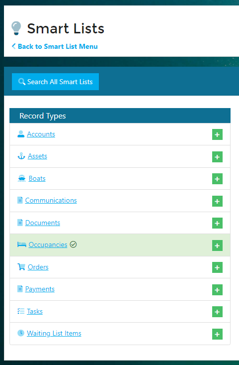
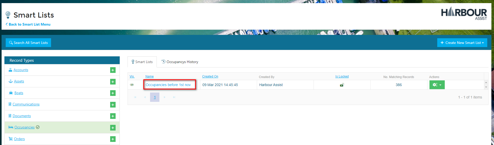
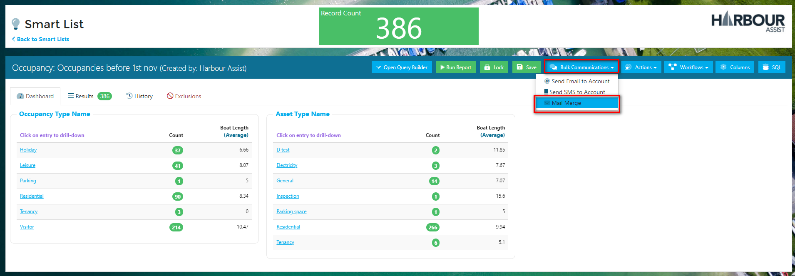
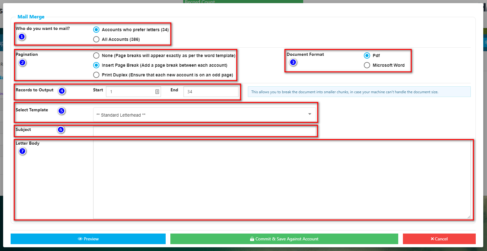
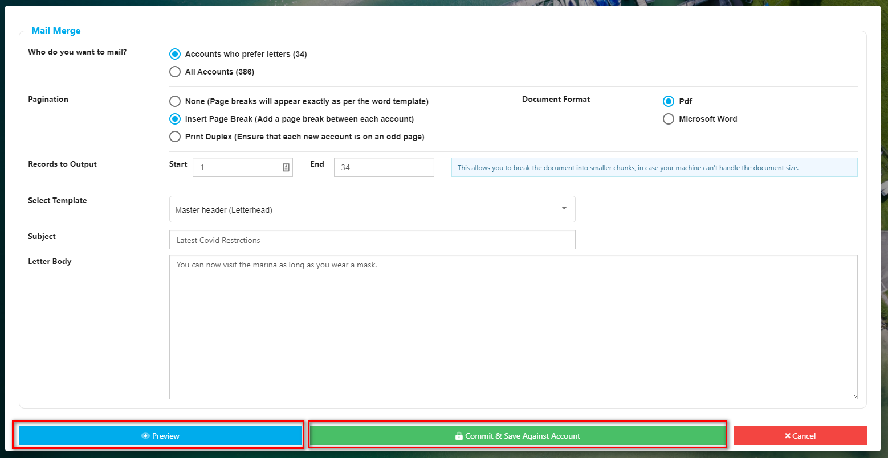
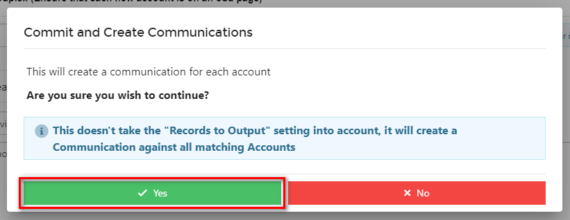

# Creating Letters in Bulk \(Mail Merge\)

Although we now live in an age where most communications are sent by email, there are still some things that are better sent by post and some customers who prefer to receive correspondence by post. Using the Mail Merge feature in Harbour Assists means you can create personalised letters quickly and easily.

From the _Home_ screen click on _Smart List Hub_.

Then within the Smart Lists menu choose Smart Lists.

Find the Smart List that you want to use by clicking on the relevant Record Type name.

Then open up the Smart List by clicking on its name.

Using the _Bulk Communications_ dropdown select _Mail Merge_.

Complete the following steps:-

1. Who do you want to mail? Do you want to create a letter for all records on the Smart List, or just those who prefer letters because you are sending a bulk email to those who prefer emails?
2. Pagination. How do you want your letters to print out?
3. Document Format. Do you want the letters to be created as a PDF file \(not editable\) or Word \(editable\).
4. Records to Output. Can your printer cope with a multiple page print? If it has a tendency to get jammed it may be better to print a few records at a time \(1 - 10, then 11-20 etc\).
5. Select Template. Select which template you want to use.

   ?&gt; For more documentation about allocating Templates click [here](https://github.com/glaidler/docs-1/tree/a9b2fde53025657e319d99966ea9a02a32cbd61d/smartlists/communications/LetterTemplates.md).

6. Subject. Give you letter a subject - this won't be seen by the customer, but it will help you find the letter in the Communications tab.
7. Letter Body. Create the body of your letter if this isn't already part of your template.

It's advisable to Preview your letters to ensure you are happy with the layout, once you are click on _Commit & Save Against Account_.

Confirm that you wish to continue by clicking _Yes_.

Download your letters for printing by clicking on either of the Download buttons.

