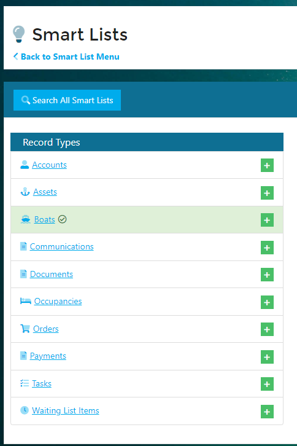
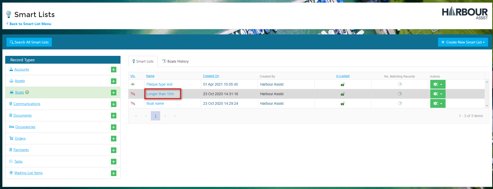
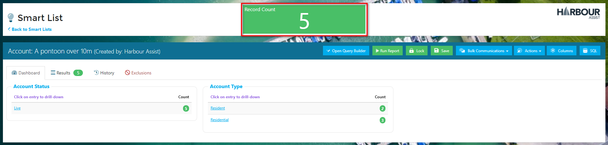
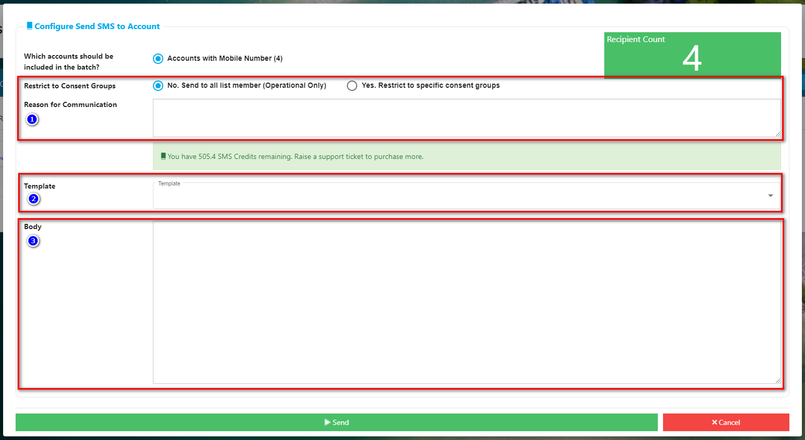
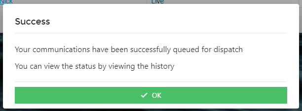

# Sending a Bulk SMS (Text Message) #

You may sometimes have a situation where you need to contact a group of customers urgently - the best way to do this is by a sending a SMS text message.

?> NB.  SMS credits are required to send text messages from Harbour Assist - if you don't have any credits and would like to purchase some please contact us using the help question mark for more details. 

From the *Home* screen click on *Smart List Hub*.

Then within the Smart Lists menu choose Smart Lists.

Find the Smart List that you want to use by clicking on the relevant Record Type name or using the Search All Smart Lists button.

Then open up the Smart List by clicking on its name.

Using the *Bulk Communications* dropdown select *Send SMS to Account*.

?> NB: The list I am using has a Record Count of 5, however only 4 of these Accounts have a mobile number.

This is indicated in the SMS composer pop-up.

Complete the following steps:-

1. Is this an Operational or Marketing communication? - remember if it's Marketing you should only send to those who have opted in to receive the communications. You will be prompted to either give an Operational justification or to choose which Consent Groups the communication should go to.
2. Choose which template to use if you want to use one.
3. Create the body of your SMS.

Then click *Send*.

A confirmation of the send will pop up on your screen.

?> NB. The number of credits you have remaining is displayed in the green box.  You will not be able to dispatch any of the SMS's if you don't have enough credits.  Contact us using the help question mark to purchase more credits. 

