# Finding, Viewing & Editing Smart Lists

## Finding a Smart List

Navigate to the Smart List index page by clicking on _Smart Lists_.

The Index page will display all the lists within the Record Type that you last viewed - you will see the Record Type selected is shown in green. To view the Lists for a different Record Type just click on the Record Type Name.

The Lists will display in created date order by default, but you can sort them into any order you wish by clicking on any of the column headers that show in blue.

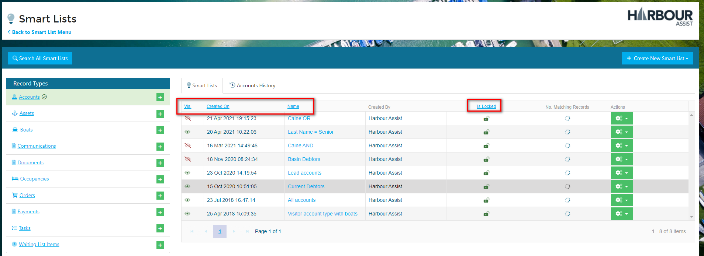

To open a List click on the List Name.

If you want to Search for Lists within all the Record Types, you can use the _Search All Smart Lists_ button.

Type in a key word - we've used _Debt_,

And all lists with Names containing that word will be displayed.

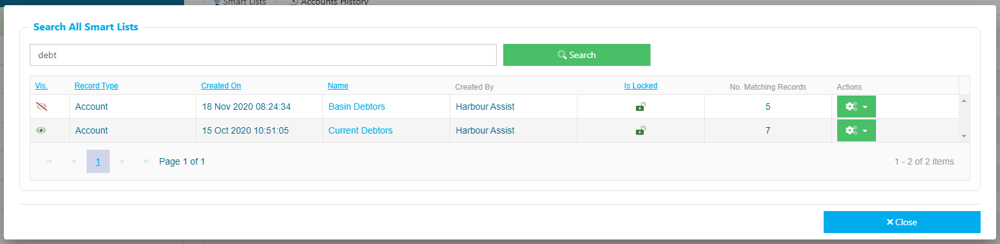

## Viewing a Smart List

When you open up a Smart List the Record Count will display at the top of the page and the Dashboard summary will show a breakdown of some of the results - the results that are shown on the Dashboard will depend on the Record Type of the List.

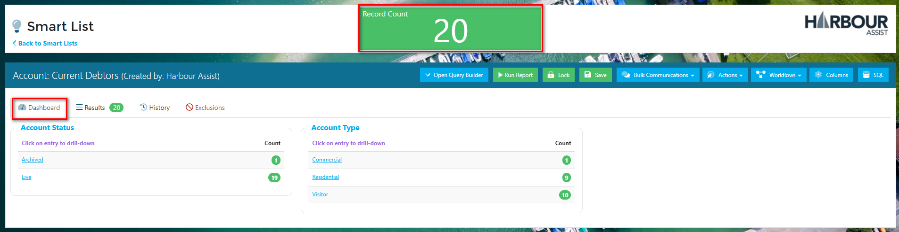

If you want to see the Criteria that have been used to create the Smart List, click on the _Open Query Builder_.

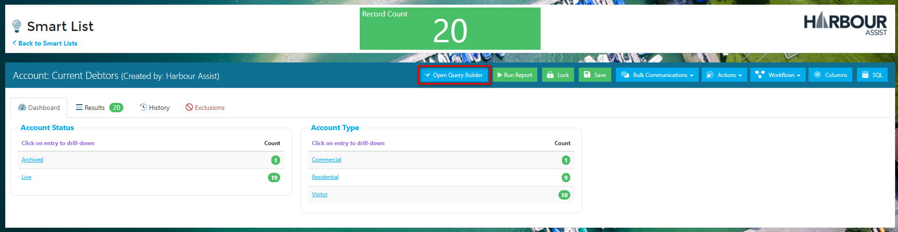

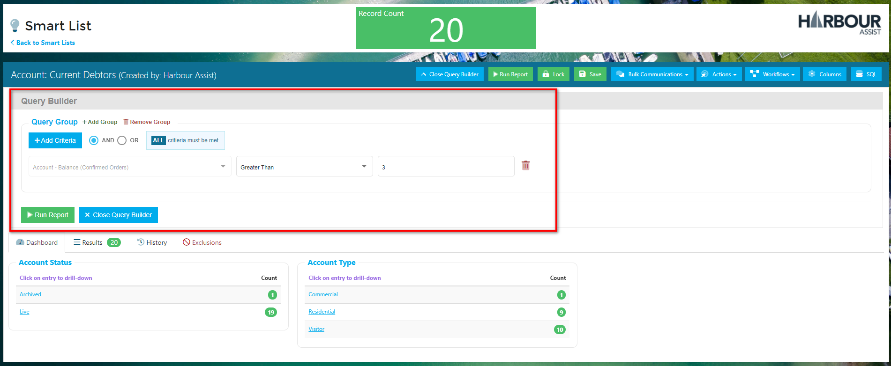

Use the _Close Query Builder_ button to hide this information once you have viewed it.

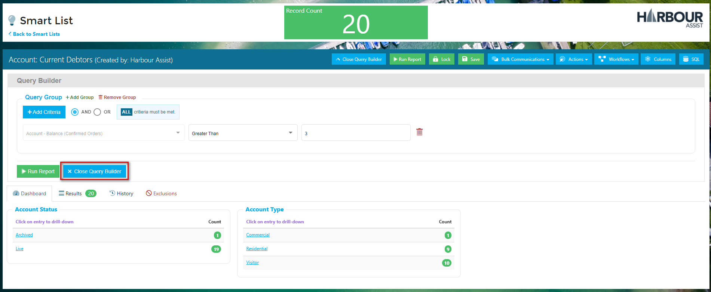

To see the detailed information of the records that make up the list, click on the _Results_ tab. The columns shown will depend on the Record Type of the List.

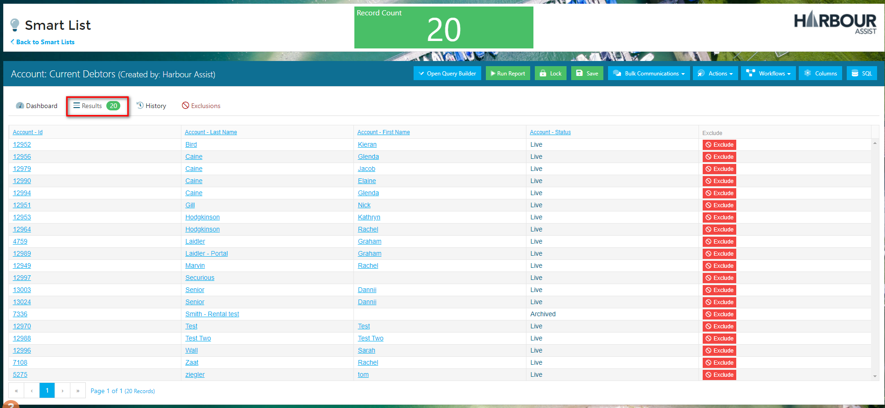

Using the _Columns_ button you can add more columns to display in your Results list.

?&gt; NB: If you Save the Smart List after adding more columns the changes will be applied globally and will show for all users.

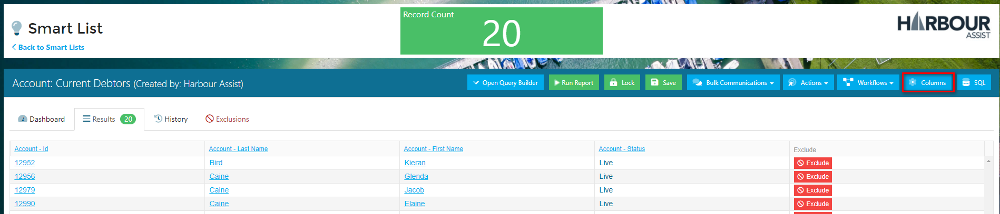

A pop-up box will appear showing you the additional columns that are available - different columns are available depending on the Record Type.

Add the ones you want by clicking in the box, then click _Apply_.

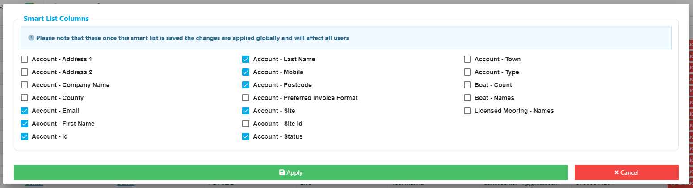

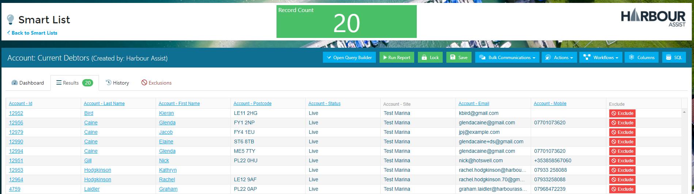

## Editing a Smart List

To edit a Smart List, open up the List you wish to Edit and then click on the _Open Query Builder_ button.

?&gt; NB: You will not be able to edit a Locked smart list.

The current Criteria will show.

You can remove any of the current Criteria by clicking on the _bin_ symbol. To any additional Criteria click on the _+Add Criteria_ button and select from the pop-up list in the same way as you do to create a Smart List.

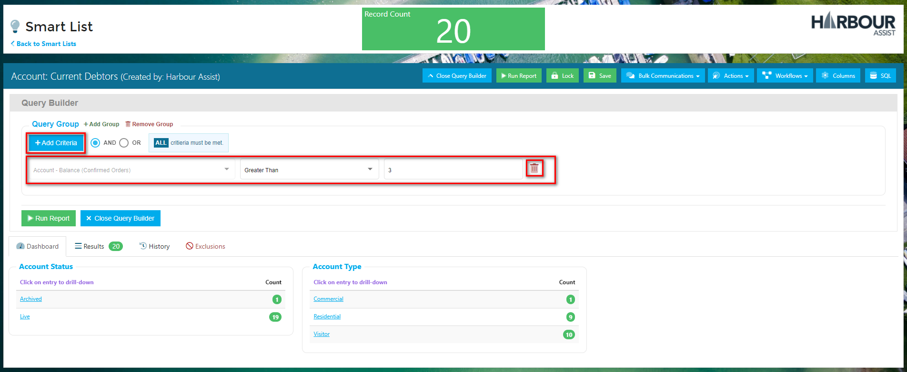

?&gt; NB: Remember to click on the _Query Updated - Run Report_ button if you add, remove or change any Criteria to update your results.

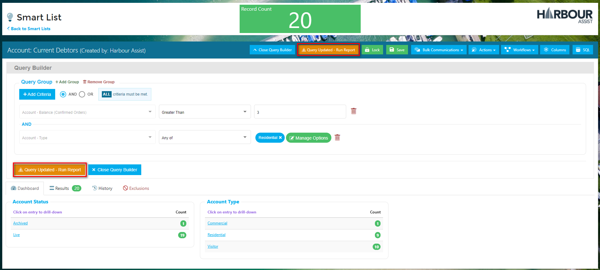

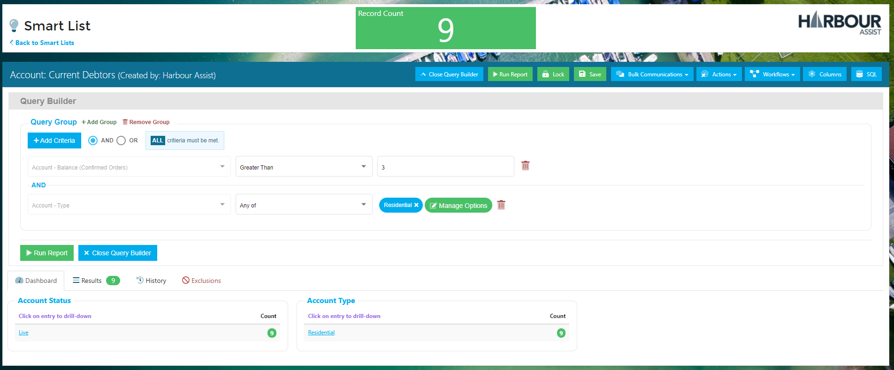

Click on the _Save_ button if you wish to save the Criteria changes.

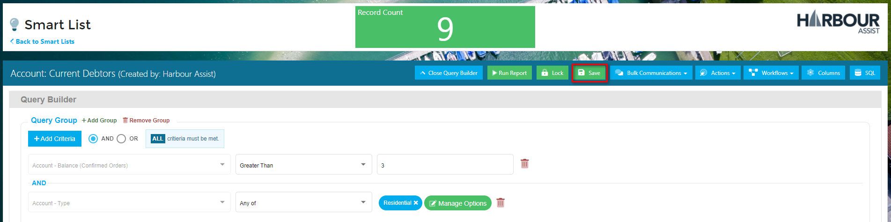

If you try to exit a Smart List where changes have been made and not saved, a warning will appear - just choose the relevant option.

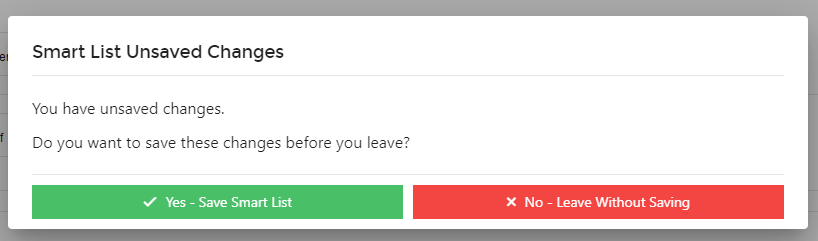

