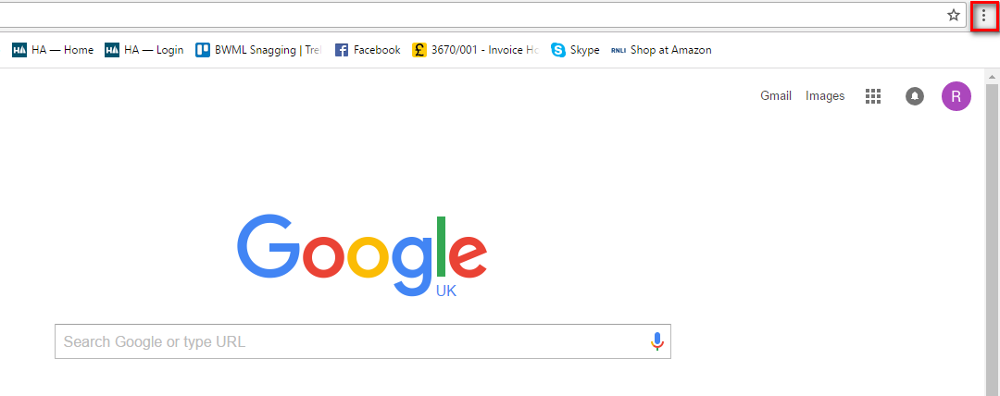
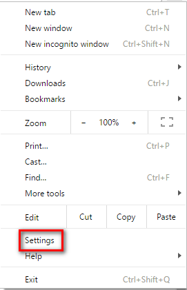
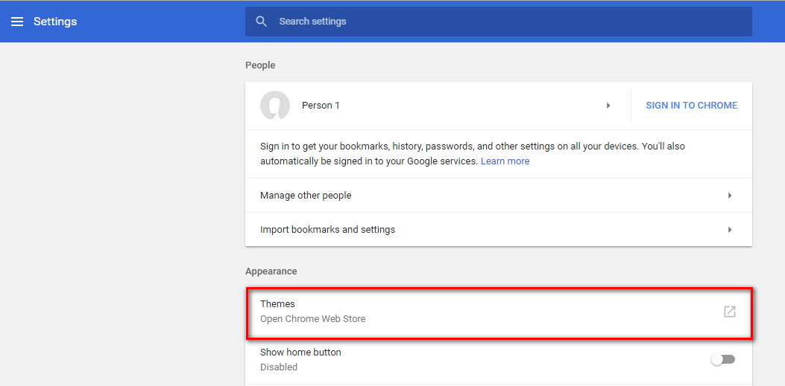
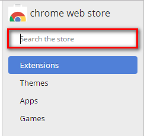
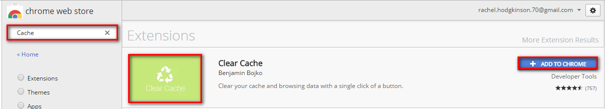
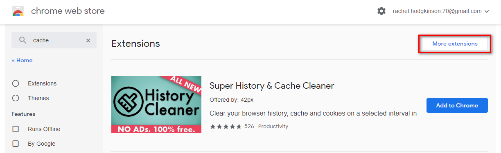
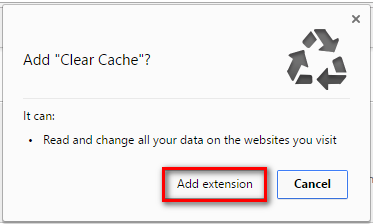
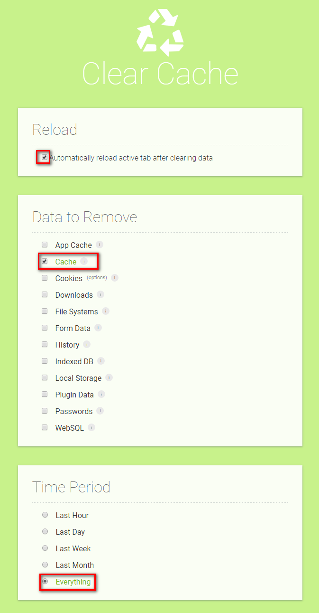
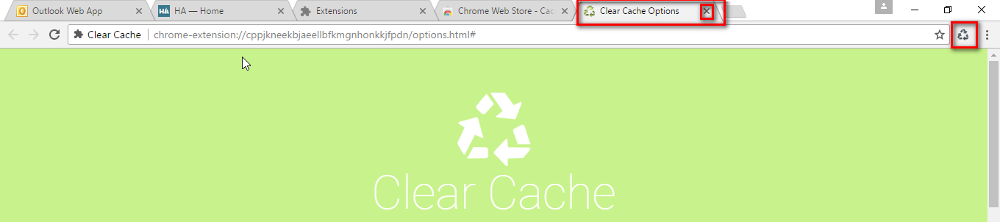
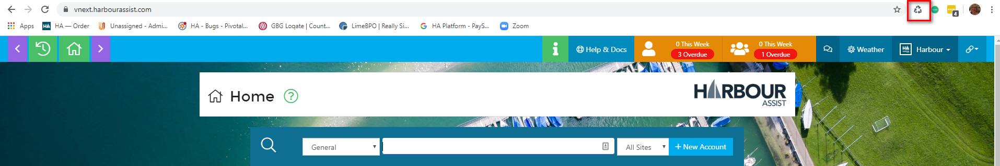

# Clear Cache Extension \#

In order for the system to work effectively, particularly after a new release to the system, it may be necessary to clear the Cache in Chrome.

By following the instructions below you can set this up so that the Cache can be cleared with a single click.

First, click on the _Customise and Control Google Chrome_ button which can be found at the top of the screen when you have Chrome open.

Select _Settings_.

Select _Open Chrome Web Store_

In the search box type in _Cache_.

Find the Clear Cache extension \(as shown below\) and click on _Add to Chrome_.

If it doesn't show straight away, click on More Extensions.

Click on _Add Extension_.

Select the _Reload, Cache and Everything_ options.

The Clear Cache _triangle_ will appear at the top of your page. You can now close down the _Clear Cache Options_ tab.

The _triangle_ will show at the top of your page whenever you have Chrome open and in future to clear the Cache just a single click on this symbol is required.

