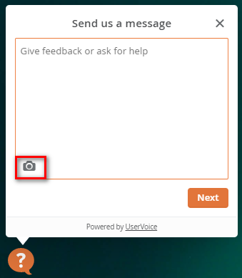
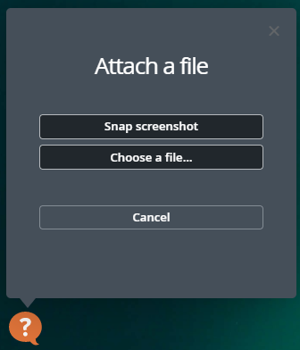
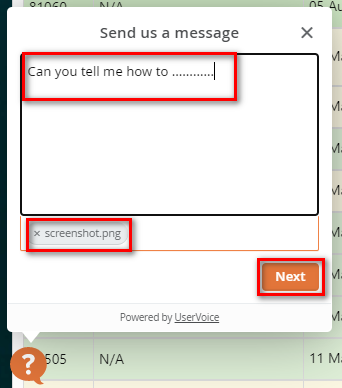
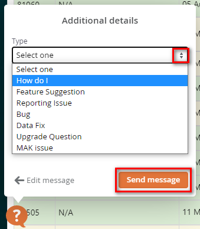

# Getting Help & Support

If you can't find what you are looking for in this Help Documentation please send us a _Help Ticket_ by clicking on the orange question mark that appears in the bottom left corner of the screen.

It is helpful for us if you are on the actual screen where you require help when submitting the ticket as it will give us a referral link to that page. A screen shot of the issue is also very useful \(click on the camera icon\).

Click on _Snap screenshot_ or if you want to attach a file that is saved outside of Harbour Assist use the _Choose a file_ option.

The screenshot or file will show that it is attached.

Now you can type in your message explaining what the problem is, then click on the _Next_ button.

Select the query type from the dropdown list and click on _Send Message_.

Once we receive the help request, it is triaged and passed to the most appropriate member of the team to investigate and respond.

An automated email acknowledging receipt of the Help Ticket will be sent to the _User_ login email address.

Channeling all requests for help and reporting of issues through the ticketing system is important to ensure that there is no delay to responses \(they are visible to all members of the HA team, rather than an email to 1 individual\) and also helps us to see any pattern in issues that arise.

?&gt; NB. Help tickets are always prioritised over any other form of contact - so a direct email will not get a faster response.

