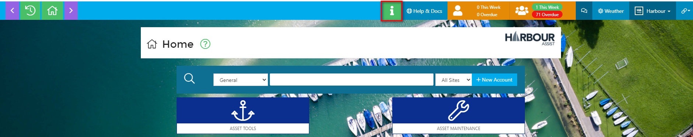
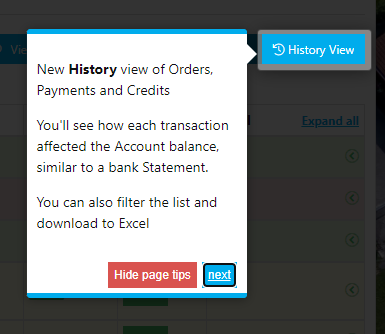

# Guidance Tips

To help you find your way around Harbour Assist we have some _Guidance Tips_, these tips will automatically be displayed as new ones are added and if you wish to revisit any tips you can hit the info button at the top of the screen.

?&gt; NB. The info button will be hidden if you are on a page that has no tips.

When a _Guidance Tip_ is displayed the rest of the screen will be faded out to highlight the tip. After reading you can _Hide page tips_ or click on _Next_ to see the next tip on that page.

